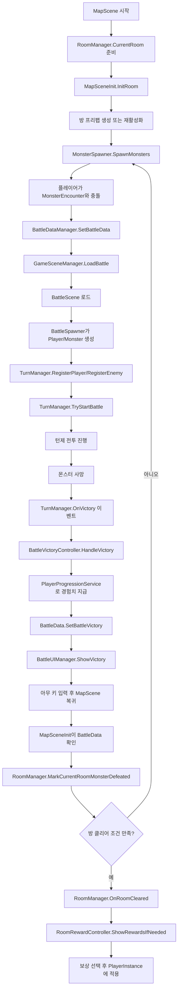
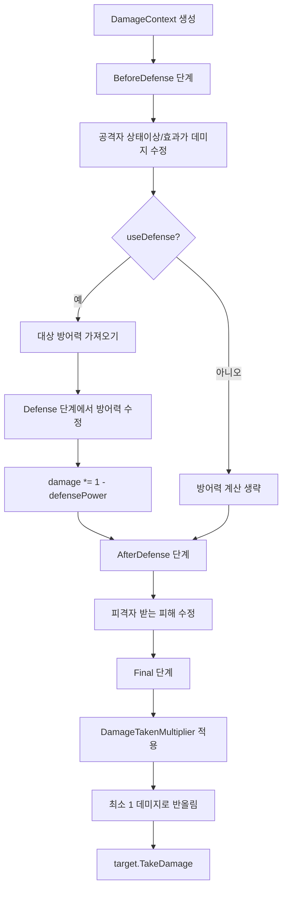
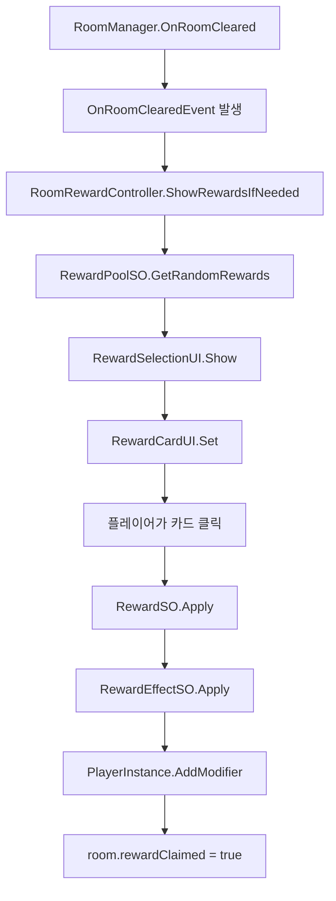

# ArrowHunter 게임 구조, 흐름, 문법 정리

작성일: 2026-04-15  
목적: 현재 ArrowHunter 프로젝트의 핵심 구조를 복습하고, 이후 보상 시스템, 아이템 시스템, 스킬, 몬스터 패턴, 애니메이션 작업을 이어가기 위한 기준 문서

---

## 1. 전체 구조 요약

ArrowHunter는 현재 크게 다음 흐름으로 움직인다.

1. 맵 씬에서 플레이어가 방을 이동한다.
2. 방 안의 몬스터와 충돌하면 몬스터 데이터가 `BattleDataManager`에 저장된다.
3. 배틀 씬으로 이동한다.
4. 배틀 씬에서 플레이어와 몬스터가 생성되고 `TurnManager`에 등록된다.
5. 턴제 전투가 진행된다.
6. 몬스터 처치 시 경험치를 지급하고 배틀 결과 UI를 보여준다.
7. 아무 키 입력 후 맵 씬으로 돌아온다.
8. 맵 씬에서 해당 몬스터가 처치된 것으로 기록된다.
9. 방 클리어 조건을 만족하면 보상 선택 UI가 열린다.
10. 보상을 선택하면 플레이어 런타임 스탯에 효과가 적용된다.

핵심 설계 방향은 다음과 같다.

- `ScriptableObject`는 원본 데이터다.
- `PlayerInstance`는 플레이어의 실제 런타임 데이터다.
- `BattleDataManager`는 씬을 넘어 유지되는 전투용 런타임 관리자다.
- `BattleData`는 씬 전환 사이에 잠깐 전달되는 결과 데이터다.
- `TurnManager`는 턴 흐름만 관리하는 방향이 좋다.
- 실제 공격, 코스트, 스킬 처리 등은 `BattleActionService`가 담당한다.
- 데미지 계산은 `DamageResolver`와 `DamageContext`로 모은다.
- 상태이상은 `StatusHandler`가 목록을 관리하고, 각 효과의 실제 동작은 개별 `StatusEffectSO`가 담당한다.

---

## 2. 전체 게임 플로우



이 흐름에서 가장 중요한 구분은 다음이다.

- 몬스터 한 마리 처치: 경험치 지급
- 방 클리어: 보상 선택
- 보스 처치: 이후 스테이지/결과 흐름으로 확장 가능

즉, `OnVictory`는 "방 클리어"가 아니라 "배틀에서 몬스터 한 마리를 이김"에 가깝다.

---

## 3. 폴더 구조와 역할

현재 폴더는 다음 역할로 나누는 것이 자연스럽다.

```text
Assets/02.Scripts
  01_Common
    Scene
    공통 enum, 씬 이름, 씬 전환

  02_Data
    Runtime
    씬 사이에 유지되거나 전달되는 런타임 데이터

    Stats
    캐릭터 원본 스탯, 플레이어 런타임 스탯, 스탯 보정값

  03_BattleSceneScripts
    Cost
    Damage
    Entity
    Flow
    Skill
    Status
    UI

  04_MapSceneScripts
    Monster
    Player
    Room
    InteractionSystem

  05_Reward
    보상 데이터, 보상 선택 UI, 보상 적용 효과

  PlayerGrowth
    경험치, 레벨업, 성장 처리
```

정리 기준은 "어느 씬에서 주로 쓰이는가"와 "어떤 책임을 갖는가"다.

- 여러 씬에서 같이 쓰는 것: `01_Common`
- 원본 데이터와 런타임 데이터: `02_Data`
- 전투 씬 전용: `03_BattleSceneScripts`
- 맵 씬 전용: `04_MapSceneScripts`
- 보상 선택 시스템: `05_Reward`
- 경험치/레벨업: `PlayerGrowth`

---

## 4. 데이터 구조

### 4.1 BaseStatSO

파일: `Assets/02.Scripts/02_Data/Stats/BaseStatSO.cs`

`BaseStatSO`는 캐릭터 원본 스탯이다. 플레이어 직업, 몬스터, 보스 같은 캐릭터의 기본값을 에셋으로 저장한다.

주요 필드:

- `jobName`: 캐릭터 이름
- `prefab`: 생성할 프리팹
- `maxHp`: 최대 체력
- `attackPower`: 방향별 공격력
- `defensePower`: 방어력
- `maxCost`, `startCost`, `baseCostRecovery`: 코스트 관련 값
- `statusPower`: 상태이상 위력
- `statusResistance`: 상태이상 저항
- `basicAttackMultiplier`: 기본 공격 배율
- `skillPowerMultiplier`: 스킬 위력 배율
- `damageTakenMultiplier`: 받는 피해 배율
- `comboDamageMultiplier`: 콤보 공격 배율
- `expReward`: 처치 시 경험치
- `skillList`: 해당 캐릭터가 사용할 스킬 목록

중요한 점:

- `BaseStatSO`는 원본 데이터다.
- 런타임 중 변하는 플레이어 스탯은 `PlayerInstance`에서 관리하는 것이 안전하다.
- 몬스터는 매 전투마다 새로 생성되므로 `BaseStatSO` 값을 그대로 써도 큰 문제가 적다.

### 4.2 DirectionalInt

파일: `Assets/02.Scripts/02_Data/Stats/DirectionalInt.cs`

방향별 공격력을 저장하는 구조체다.

```csharp
public int up;
public int down;
public int left;
public int right;
```

사용 이유:

- 플레이어가 방향마다 다른 공격력을 가질 수 있다.
- 보상이나 장비가 "위쪽 공격력 +3"처럼 특정 방향만 강화할 수 있다.
- `Direction` enum과 연결해서 `Get(Direction dir)`로 값을 꺼낼 수 있다.

### 4.3 PlayerInstance

파일: `Assets/02.Scripts/02_Data/Stats/PlayerInstance.cs`

`PlayerInstance`는 실제 플레이어의 런타임 데이터다. 게임 진행 중 유지되어야 하는 체력, 레벨, 경험치, 보상으로 얻은 스탯 보정값을 가진다.

주요 역할:

- 현재 체력 저장
- 레벨과 경험치 저장
- 스탯 보정값 목록 관리
- 최종 스탯 계산
- 방향별 공격력 계산
- 스킬 위력, 상태이상 위력 계산

중요한 구조:

```csharp
private readonly List<StatModifier> _modifiers;
```

이 리스트에 보상, 레벨업, 아이템, 버프 효과가 쌓인다. 최종 스탯은 `BaseStatSO`의 기본값에 `_modifiers`를 적용해서 계산한다.

### 4.4 StatModifier

파일: `Assets/02.Scripts/02_Data/Stats/StatModifier.cs`

스탯을 바꾸는 하나의 효과 단위다.

주요 필드:

- `statType`: 어떤 스탯을 바꿀지
- `mode`: 고정값 증가인지, 퍼센트 증가인지
- `value`: 변경량
- `duration`: 지속 턴 수
- `sourceId`: 어떤 보상/버프/아이템에서 왔는지

계산 방식:

```text
최종값 = (기본값 + Flat 합계) * (1 + Percent 합계)
```

예시:

- 공격력 10
- Flat +3
- Percent +0.2

결과:

```text
(10 + 3) * 1.2 = 15.6
```

---

## 5. 씬 전환과 런타임 데이터

### 5.1 GameSceneManager

파일: `Assets/02.Scripts/01_Common/Scene/GameSceneManager.cs`

씬 전환을 담당한다.

주요 특징:

- 싱글톤 구조
- `DontDestroyOnLoad`로 씬이 바뀌어도 유지
- 배틀 씬, 맵 씬, 결과 씬 이동 함수 제공

중요한 코루틴:

```csharp
private IEnumerator WaitAndLoad(string sceneName)
```

역할:

- 결과 UI가 뜬 뒤 최소 0.5초 기다린다.
- 이전 입력이 남아 있으면 모두 뗄 때까지 기다린다.
- 새 키 입력이 들어오면 씬을 전환한다.

문법 포인트:

- `yield return null`: 다음 프레임까지 대기
- `WaitForSecondsRealtime`: `Time.timeScale`이 0이어도 실제 시간 기준으로 대기
- `Input.anyKey`: 키가 눌려 있는 동안 true
- `Input.anyKeyDown`: 키를 누른 딱 그 프레임에만 true

### 5.2 BattleDataManager

파일: `Assets/02.Scripts/02_Data/Runtime/BattleDataManager.cs`

씬을 넘어 유지되는 전투 데이터 관리자다.

담당:

- 플레이어 원본 SO 보유
- `PlayerInstance` 생성 및 유지
- 현재 전투할 적 데이터 저장
- 보스전 여부 저장
- 전투 종료 후 플레이어 HP 동기화

흐름:

```text
MonsterEncounter.OnEncountMonster
  -> BattleDataManager.SetBattleData
  -> CurrentEnemyStat 저장
  -> BattleScene에서 BattleSpawner가 사용
```

### 5.3 BattleData

파일: `Assets/02.Scripts/02_Data/Runtime/BattleData.cs`

씬 전환 사이에 결과를 전달하는 정적 데이터다.

담당:

- 전투 승리 여부
- 클리어 턴 수
- 맵에서의 플레이어 위치
- 입장 방향
- 현재 방 월드 좌표
- 처치한 적 데이터
- 획득 경험치와 레벨업 결과

중요한 구분:

- `BattleDataManager`: 오래 유지되는 런타임 관리자
- `BattleData`: 씬 전환용 임시 결과 저장소

---

## 6. 맵 씬 구조

### 6.1 RoomSO

파일: `Assets/02.Scripts/04_MapSceneScripts/Room/RoomSO.cs`

방의 원본 데이터다.

주요 필드:

- `roomType`: 일반, 보스, 이벤트 등 방 타입
- `clearCondition`: 방 클리어 조건
- `roomSize`: 방 간 거리 계산용 크기
- `openUp`, `openDown`, `openLeft`, `openRight`: 열린 방향
- `monsters`: 스폰할 몬스터 목록
- `isBoss`: 보스방 여부
- `roomPrefab`: 실제 방 프리팹

### 6.2 RoomInstance

파일: `Assets/02.Scripts/04_MapSceneScripts/Room/RoomInstance.cs`

런타임에서 생성된 방 하나의 상태다.

담당:

- 방 원본 데이터 보관
- 그리드 좌표와 월드 좌표 저장
- 방 클리어 여부 저장
- 보상 수령 여부 저장
- 남은 몬스터 목록 관리

중요한 함수:

```csharp
InitializeMonsters()
```

`RoomSO.monsters`를 바탕으로 `_remainingMonsters` 목록을 초기화한다. 한 번만 초기화되도록 `_monstersInitialized`를 사용한다.

```csharp
MarkMonsterDefeated(BaseStatSO defeatedStat)
```

전투에서 이긴 몬스터 하나를 남은 몬스터 목록에서 제거한다.

```csharp
IsClearConditionMet()
```

방 클리어 조건이 만족되었는지 확인한다.

### 6.3 RoomManager

파일: `Assets/02.Scripts/04_MapSceneScripts/Room/RoomManager.cs`

현재 방, 방문한 방, 방 이동, 포탈 상태, 방 클리어를 관리한다.

담당:

- 현재 방 저장
- 방문한 방 Dictionary 관리
- 방 오브젝트 Dictionary 관리
- 새 방 생성 결정
- 포탈 열림/잠김 처리
- 방 클리어 이벤트 발행

중요 이벤트:

```csharp
public static event Action OnRoomChanged;
public static event Action<RoomInstance> OnRoomClearedEvent;
```

흐름:

- 플레이어가 포탈 진입
- `PortalController.OnTriggerEnter`
- `RoomManager.MoveToRoom`
- `OnRoomChanged` 이벤트 발생
- `MapSceneInit.InitRoom` 호출

### 6.4 MapSceneInit

파일: `Assets/02.Scripts/04_MapSceneScripts/Room/MapSceneInit.cs`

맵 씬에서 현재 방을 실제 씬에 배치하는 초기화 담당이다.

담당:

- 방 프리팹 생성 또는 재활성화
- 방 오브젝트 등록
- 전투 승리 후 돌아왔을 때 몬스터 처치 처리
- 플레이어 위치 설정
- 몬스터 스폰 호출

전투 후 복귀 흐름:

```text
BattleData.hasPendingBattleVictory == true
  -> RoomManager.MarkCurrentRoomMonsterDefeated
  -> BattleData.ClearPendingBattleVictory
```

### 6.5 MonsterEncounter

파일: `Assets/02.Scripts/04_MapSceneScripts/Monster/MonsterEncounter.cs`

맵 위 몬스터와 플레이어 충돌을 감지한다.

담당:

- 플레이어 충돌 확인
- 플레이어 맵 위치 저장
- 몬스터 데이터를 이벤트로 전달
- 배틀 씬으로 전환

중요 이벤트:

```csharp
public static event Action<BaseStatSO, bool> OnEncountMonster;
```

`BattleDataManager`가 이 이벤트를 구독해서 `CurrentEnemyStat`을 저장한다.

---

## 7. 배틀 씬 구조

### 7.1 BattleSpawner

파일: `Assets/02.Scripts/03_BattleSceneScripts/Flow/BattleSpawner.cs`

배틀 씬에서 플레이어와 몬스터를 생성한다.

플레이어 생성:

```text
BattleDataManager.playerStatSO
  -> prefab Instantiate
  -> BattleEntity.InitializeFromInstance(PlayerInstance)
  -> TurnManager.RegisterPlayer
```

몬스터 생성:

```text
BattleDataManager.CurrentEnemyStat
  -> prefab Instantiate
  -> BattleEntity.Initialize(BaseStatSO)
  -> TurnManager.RegisterEnemy
```

주의:

- 배틀용 플레이어 프리팹에는 `BattleEntity`와 `PlayerCombatController`가 필요하다.
- 몬스터 프리팹에는 `BattleEntity`와 `EnemyController`가 필요하다.
- 배틀 씬에서 맵 이동이 발생하면 안 되므로, 배틀용 플레이어에는 `MapPlayerController`를 붙이지 않거나 비활성화해야 한다.

### 7.2 BattleEntity

파일: `Assets/02.Scripts/03_BattleSceneScripts/Entity/BattleEntity.cs`

전투에 참여하는 캐릭터 공통 래퍼다.

담당:

- 현재 체력
- 원본 스탯 참조
- 플레이어라면 `PlayerInstance` 참조
- 상태이상 핸들러 보유
- 공격력, 방어력, 스킬 위력, 상태이상 위력 계산 함수 제공
- 최종 데미지 적용
- 사망 시 `TurnManager.OnEntityDied` 호출

중요한 설계:

```text
플레이어:
  PlayerInstance 기준으로 최종 스탯 계산

몬스터:
  BaseStatSO 기준으로 스탯 계산
```

이렇게 하면 플레이어는 보상/레벨/아이템 영향을 받고, 몬스터는 SO 원본값을 간단히 사용한다.

### 7.3 BattleRuntime

파일: `Assets/02.Scripts/03_BattleSceneScripts/Flow/BattleRuntime.cs`

배틀 중 필요한 런타임 참조를 묶는 클래스다.

담당:

- 플레이어 `BattleEntity`
- 몬스터 `BattleEntity`
- 플레이어 컨트롤러
- 몬스터 컨트롤러
- 전투 시작 가능 여부 확인

`TurnManager`가 모든 참조를 직접 들고 있으면 커지기 쉬우므로, 런타임 참조를 별도 클래스로 묶은 구조다.

### 7.4 TurnManager

파일: `Assets/02.Scripts/03_BattleSceneScripts/Flow/TurnManager.cs`

턴 흐름을 관리한다.

담당:

- 플레이어/몬스터 등록 받기
- 양쪽 준비 완료 시 전투 시작
- 현재 배틀 상태 관리
- 플레이어 입력을 전투 처리 서비스로 전달
- 턴 종료 처리
- 승리/패배 이벤트 발행

중요한 방향:

- `TurnManager`는 계산을 직접 많이 하지 않는 것이 좋다.
- 공격, 코스트, 스킬, 콤보 계산은 `BattleActionService`로 보내는 것이 좋다.
- `TurnManager`는 "지금 누구 턴인가"와 "어떤 상태로 바꿀 것인가"에 집중한다.

### 7.5 BattleState

파일:

- `BattleState.cs`
- `PlayerAttackState.cs`
- `EnemyTurnState.cs`

상태 패턴 구조다.

`PlayerAttackState`:

- 플레이어 공격 턴
- 스페이스바로 스킬 입력 시작/발동
- 방향키로 공격
- 콤보 가능 상태에서 Z로 턴 넘김
- 스턴이면 턴 스킵

`EnemyTurnState`:

- 적 공격 방향을 정함
- 플레이어가 방향키로 방어 방향 입력
- 방어 성공/실패를 `BattleActionService`가 처리

### 7.6 BattleActionService

파일: `Assets/02.Scripts/03_BattleSceneScripts/Flow/BattleActionService.cs`

실제 전투 행동 계산 담당이다.

담당:

- 기본 공격 코스트 소비
- 방향 입력을 상태이상으로 필터링
- 스킬 버퍼 입력
- 스킬 발동
- 콤보 가능 여부 계산
- 플레이어 공격 시퀀스
- 적 공격 시퀀스
- 턴 종료 시 코스트 회복

흐름:

```text
PlayerAttackState.Update
  -> TurnManager.HandlePlayerDirectionInput
  -> BattleActionService.TryPlayerAttack
  -> StatusHandler.ModifyDirectionInput
  -> CostHandler.SpendCost
  -> PlayerAttackSequence
  -> DamageResolver.CreateBasicAttack
  -> DamageResolver.Apply
```

### 7.7 CostHandler

파일: `Assets/02.Scripts/03_BattleSceneScripts/Cost/CostHandler.cs`

코스트만 담당한다.

담당:

- 현재 코스트
- 최대 코스트
- 코스트 소비 가능 여부
- 코스트 소비
- 코스트 회복
- 방어 성공 보너스

---

## 8. 데미지 구조

### 8.1 DamageContext

파일: `Assets/02.Scripts/03_BattleSceneScripts/Damage/DamageContext.cs`

데미지 계산에 필요한 모든 정보를 담는 객체다.

주요 변수:

- `source`: 공격자
- `target`: 피격자
- `damageType`: 기본 공격, 스킬, 상태이상, 고정 피해 종류
- `statusType`: 상태이상 데미지라면 어떤 상태이상인지
- `direction`: 공격 방향
- `isCombo`: 콤보 공격 여부
- `damage`: 현재 계산 중인 데미지 값
- `defensePower`: 현재 계산 중인 방어력 값
- `phase`: 데미지 계산 단계
- `useDefense`: 방어력 적용 여부
- `useOutgoingModifiers`: 공격자 쪽 데미지 보정 적용 여부
- `useIncomingModifiers`: 피격자 쪽 데미지 보정 적용 여부
- `useDamageTakenMultiplier`: 받는 피해 배율 적용 여부

중요한 생각 방식:

```text
DamageContext는 계산 결과가 아니라 계산 중간 상태다.
```

상태이상이나 아이템은 이 `context`를 보고 필요한 단계에서 값을 바꿀 수 있다.

### 8.2 DamageResolver

파일: `Assets/02.Scripts/03_BattleSceneScripts/Damage/DamageResolver.cs`

최종 데미지를 계산하고 적용한다.

계산 순서:



현재 구조의 장점:

- 기본 공격, 스킬, 상태이상 데미지를 같은 계산기로 통합할 수 있다.
- 취약, 허약, 화상 방어력 감소 같은 효과를 같은 흐름에서 처리할 수 있다.
- 계산 단계가 나뉘어서 "방어력 전에 증가"와 "방어력 후 증가"를 구분할 수 있다.

주의할 점:

- 현재 코드 기준 `CreateStatusDamage`는 매개변수로 `useIncomingModifiers`, `useDefense`를 받지만, 실제 반환 객체에는 항상 `false`로 들어가 있다.
- 출혈처럼 방어력과 취약 효과를 적용하고 싶다면 이 매개변수를 반환 객체에 연결해야 한다.

예상 수정 방향:

```csharp
useDefense = useDefense,
useIncomingModifiers = useIncomingModifiers,
```

---

## 9. 상태이상 구조

### 9.1 전체 구조

상태이상은 다음 네 부분으로 나뉜다.

```text
StatusEffectSO
  상태이상 원본 데이터와 동작 정의

StatusEffectInstance
  실제 적용된 상태이상 한 개의 런타임 상태

StatusHandler
  한 BattleEntity가 가진 상태이상 목록 관리

개별 EffectSO
  PoisonEffectSO, BurnEffectSO, BleedEffectSO 등
```

### 9.2 StatusEffectSO

파일: `Assets/02.Scripts/03_BattleSceneScripts/Status/Effect/StatusEffectSO.cs`

상태이상의 기본 클래스다.

주요 필드:

- `effectName`: 상태이상 종류
- `duration`: 지속 턴 수
- `maxStack`: 최대 중첩
- `durationRule`: 이미 걸려 있을 때 지속시간 처리 방식
- `stackRule`: 중첩 가능 여부
- `isActionDisable`: 행동 불가 여부
- `disablesSkill`: 스킬 사용 불가 여부

주요 콜백:

- `OnApply`: 처음 적용될 때
- `OnRemove`: 제거될 때
- `OnTurnStart`: 턴 시작
- `OnTurnEnd`: 턴 종료
- `OnDirectionInput`: 방향 입력 시
- `OnStack`: 중첩될 때
- `ModifyDirectionInput`: 방향 입력 자체를 바꿀 때
- `ModifyDamage`: 데미지 계산 중 특정 단계에서 개입할 때

### 9.3 StatusEffectInstance

파일: `Assets/02.Scripts/03_BattleSceneScripts/Status/StatusEffectInstance.cs`

실제로 걸려 있는 상태이상의 런타임 데이터다.

주요 필드:

- `data`: 어떤 `StatusEffectSO`인지
- `source`: 누가 건 상태이상인지
- `remainingDuration`: 남은 턴
- `currentStack`: 현재 중첩
- `magnitude`: 효과 수치
- `intValue`: 정수 임시 값
- `storedDirection`: 동결처럼 저장이 필요한 방향

`magnitude`는 효과의 실제 크기를 저장하는 범용 변수다.

예시:

- 독: 최대 체력 비례 데미지 비율
- 출혈: 방향 입력 시 받을 데미지
- 화상: 턴 종료 데미지
- 취약: 피해 증가량을 저장할 수도 있음

### 9.4 StatusHandler

파일: `Assets/02.Scripts/03_BattleSceneScripts/Status/StatusHandler.cs`

한 캐릭터가 가진 상태이상 목록을 관리한다.

담당:

- 상태이상 적용
- 이미 있는 상태이상 갱신/중첩
- 턴 종료 Tick 처리
- 방향 입력 시 효과 호출
- 행동 불가/스킬 불가 확인
- 방향 입력 수정
- 데미지 계산 단계에서 효과 적용

중요한 설계:

```text
StatusHandler는 Poison, Burn, Bleed 같은 구체 이름을 몰라도 된다.
```

`StatusHandler`는 목록을 순회하며 콜백만 호출한다. 실제 효과는 개별 `StatusEffectSO`가 담당한다. 이 구조 덕분에 새 상태이상을 추가할 때 `StatusHandler`를 계속 수정하지 않아도 된다.

### 9.5 현재 상태이상 역할

`PoisonEffectSO`

- 턴 종료 시 최대 체력 비례 피해
- `magnitude`를 데미지 비율로 사용
- 중첩 시 비율 증가
- `maxRatio`로 최대 피해 비율 제한

`BurnEffectSO`

- 턴 종료 시 고정 계열 상태이상 피해
- 데미지 계산의 `Defense` 단계에서 대상 방어력 감소
- 방어력 자체를 영구 감소시키지 않고 계산 중에만 감소시키는 구조라 안전하다.

`BleedEffectSO`

- 방향 입력 시 피해
- `magnitude`를 출혈 데미지로 사용
- 방어력과 취약을 적용하고 싶다면 `CreateStatusDamage`의 플래그 연결이 필요하다.

`FreezeEffectSO`

- 적용 시 랜덤 방향 하나를 저장
- 해당 방향 입력 시 입력 실패 처리
- 코스트는 소모하지 않고 턴도 넘기지 않는 구조

`ParalyzeEffectSO`

- 일정 확률로 방향 입력 실패
- 실패 시 코스트 소모
- 스킬 버퍼 취소
- 턴은 넘기지 않음

`VulnerableEffectSO`

- `AfterDefense` 단계에서 받는 피해 증가
- 방어력 계산 후 데미지를 증가시키므로 공격력 증가와 다른 결과를 만든다.

`StunEffectSO`

- 현재 코드는 비어 있음
- 실제 행동 불가는 `StatusEffectSO` 인스펙터의 `isActionDisable` 값을 사용하는 방식으로 처리 가능

주의:

- 현재 `StatusType` enum에는 `Vulnerable`이 없다. 취약을 상태이상 타입으로 구분해서 로그나 데미지 타입에 쓰려면 enum에 추가해야 한다.
- `StatusEffectSO` 기본 클래스에 `CreateAssetMenu`가 붙어 있으면 기본 상태이상 에셋을 실수로 만들 수 있다. 장기적으로는 구체 상태이상 클래스에만 `CreateAssetMenu`를 두는 편이 안전하다.

---

## 10. 방향 입력 필터 구조

파일: `Assets/02.Scripts/03_BattleSceneScripts/Status/DirectionInputResult.cs`

상태이상은 입력을 단순히 막는 것이 아니라, 어떤 식으로 실패했는지도 알려야 한다.

`DirectionInputResult` 주요 필드:

- `direction`: 최종 입력 방향
- `isFailed`: 입력 실패 여부
- `spendCostOnFail`: 실패 시 코스트 소모 여부
- `cancelSkillBuffer`: 실패 시 스킬 버퍼 취소 여부
- `endTurnOnFail`: 실패 시 턴 종료 여부
- `failReason`: 실패 이유

예시:

```text
동결:
  특정 방향만 실패
  코스트 소모 없음
  스킬 버퍼 취소 없음
  턴 종료 없음

마비:
  확률적으로 실패
  코스트 소모 있음
  스킬 버퍼 취소 있음
  턴 종료 없음
```

이 구조 덕분에 상태이상마다 입력 실패의 결과를 다르게 만들 수 있다.

---

## 11. 스킬 구조

### 11.1 SkillSO

파일: `Assets/02.Scripts/03_BattleSceneScripts/Skill/SkillSO.cs`

스킬 원본 데이터다.

주요 필드:

- `skillName`
- `cost`
- `inputCombo`
- `effects`

### 11.2 SkillExecutor

파일: `Assets/02.Scripts/03_BattleSceneScripts/Skill/SkillExecutor.cs`

스킬 입력 버퍼와 스킬 매칭을 담당한다.

흐름:

```text
Space 입력
  -> 스킬 입력 시작

방향키 입력
  -> InputBuffer에 방향 추가

다시 Space 입력
  -> 현재 버퍼와 SkillSO.inputCombo 비교
  -> 맞는 스킬이 있으면 반환
```

### 11.3 InputBuffer

파일: `Assets/02.Scripts/03_BattleSceneScripts/Skill/InputBuffer.cs`

방향 입력 목록을 저장한다.

중요 함수:

- `StartInput`: 입력 시작
- `CancelInput`: 입력 취소 및 버퍼 초기화
- `Add`: 방향 추가
- `Matches`: 입력 콤보가 스킬 콤보와 일치하는지 확인

현재 `Matches`는 버퍼의 마지막 부분이 스킬 콤보와 일치하면 성공하는 구조다.

### 11.4 SkillEffectSO

파일:

- `SkillEffectSO.cs`
- `DamageEffect.cs`
- `ApplyStatusEffect.cs`

스킬 효과의 원본 데이터다.

현재 효과:

- `DamageEffect`: 스킬 데미지
- `ApplyStatusEffect`: 상태이상 적용

주의:

- 현재 `DamageEffect`는 `DamageResolver`를 통하지 않고 직접 방어력을 계산한 뒤 `target.TakeDamage`를 호출한다.
- 장기적으로는 스킬 데미지도 `DamageResolver.CreateSkillDamage` 같은 함수로 통합하는 것이 좋다.

---

## 12. 경험치와 레벨업 구조

### 12.1 PlayerGrowthSO

파일: `Assets/02.Scripts/02_Data/Stats/PlayerGrowthSO.cs`

레벨업 공식과 레벨업 보정값을 담는 원본 데이터다.

담당:

- 다음 레벨 필요 경험치 계산
- 레벨업 시 적용할 `StatModifier` 생성

필요 경험치 공식:

```text
baseRequiredExp + (level - 1) * requiredExpIncreasePerLevel
```

### 12.2 PlayerProgressionService

파일: `Assets/02.Scripts/PlayerGrowth/PlayerProgressionService.cs`

경험치 지급과 레벨업 적용을 담당한다.

흐름:

```text
BattleVictoryController.HandleVictory
  -> PlayerProgressionService.GrantExpFromCurrentEnemy
  -> PlayerInstance.AddExpRaw
  -> 필요 경험치 이상이면 반복 레벨업
  -> PlayerGrowthSO.CreateLevelUpModifiers
  -> PlayerInstance.AddModifier
  -> ProgressionResult 반환
```

`ProgressionResult`는 배틀 결과 UI에 표시할 정보를 담는다.

주요 필드:

- `gainedExp`
- `levelBefore`
- `levelAfter`
- `levelUpCount`

---

## 13. 보상 시스템 구조

### 13.1 보상 플로우



### 13.2 RewardPoolSO

파일: `Assets/02.Scripts/05_Reward/RewardPoolSO.cs`

보상 후보 목록에서 랜덤하게 보상을 뽑는다.

주의:

- `rewards` 리스트 안에 `None`이 있으면 보상 카드 표시나 선택 시 null 에러가 날 수 있다.
- 장기적으로는 null 필터링을 넣는 것이 안전하다.

### 13.3 RewardSO

파일: `Assets/02.Scripts/05_Reward/RewardSO.cs`

보상 하나의 원본 데이터다.

주요 필드:

- `rewardName`
- `description`
- `icon`
- `rarity`
- `effects`

클릭 후 `Apply(PlayerInstance player)`가 호출되고, 내부의 `RewardEffectSO`들이 실행된다.

주의:

- `effects` 리스트에 `None`이 있으면 `effect.Apply`에서 null 에러가 난다.
- 보상 이름과 설명은 UI에서 자동으로 채우므로 카드 Text는 비워둬도 된다.

### 13.4 RewardEffectSO

파일:

- `RewardEffectSO.cs`
- `StatModifierRewardEffectSO.cs`

보상 효과의 원본 데이터다.

현재 구조:

```text
StatModifierRewardEffectSO
  -> modifiers 목록
  -> PlayerInstance.AddModifier
```

주의:

- 현재 `StatModifierRewardEffectSO`는 SO 안의 `modifier.sourceId`를 직접 바꾼다.
- ScriptableObject 안의 데이터를 런타임에 직접 수정하면 나중에 예상치 못한 공유 문제가 생길 수 있다.
- 장기적으로는 `new StatModifier(...)`로 복사해서 넣는 방식이 더 안전하다.

### 13.5 RewardSelectionUI와 RewardCardUI

파일:

- `RewardSelectionUI.cs`
- `RewardCardUI.cs`

`RewardSelectionUI`는 패널과 카드 목록을 관리한다.  
`RewardCardUI`는 카드 하나에 보상 이름, 설명, 아이콘, 버튼 이벤트를 연결한다.

---

## 14. Unity 문법 복습

### 14.1 MonoBehaviour

Unity 오브젝트에 붙는 스크립트의 기본 클래스다.

대표 함수:

- `Awake`: 오브젝트가 생성될 때 가장 먼저 호출
- `OnEnable`: 오브젝트가 활성화될 때 호출
- `Start`: 첫 프레임 전에 호출
- `Update`: 매 프레임 호출
- `FixedUpdate`: 물리 업데이트마다 호출
- `OnDisable`: 비활성화될 때 호출
- `OnDestroy`: 파괴될 때 호출
- `OnTriggerEnter`: 트리거 충돌 시 호출

현재 프로젝트 예시:

- `RoomManager.Awake`: 싱글톤 생성
- `MapSceneInit.Start`: 현재 방 초기화
- `TurnManager.Update`: 현재 배틀 상태 업데이트
- `MapPlayerController.FixedUpdate`: Rigidbody 이동
- `MonsterEncounter.OnTriggerEnter`: 몬스터 조우 처리

### 14.2 ScriptableObject

Unity 에셋으로 저장되는 데이터 객체다.

현재 프로젝트에서 사용되는 SO:

- `BaseStatSO`
- `RoomSO`
- `SkillSO`
- `SkillEffectSO`
- `StatusEffectSO`
- `RewardSO`
- `RewardEffectSO`
- `RewardPoolSO`
- `PlayerGrowthSO`

사용 이유:

- 인스펙터에서 데이터 편집 가능
- 같은 구조의 데이터를 여러 개 만들기 쉬움
- 코드와 데이터를 분리할 수 있음

주의:

- ScriptableObject는 원본 데이터다.
- 런타임 중 변경되는 값은 별도 인스턴스나 런타임 클래스에 저장하는 것이 안전하다.

### 14.3 SerializeField

`private` 필드를 인스펙터에 노출할 때 사용한다.

```csharp
[SerializeField] private RewardPoolSO rewardPool;
```

장점:

- 외부 클래스에서 마음대로 접근하지 못하게 막는다.
- Unity 인스펙터에서는 연결할 수 있다.

### 14.4 CreateAssetMenu

ScriptableObject를 Unity 메뉴에서 생성할 수 있게 해준다.

```csharp
[CreateAssetMenu(fileName = "RewardSO", menuName = "Scriptable Objects/RewardSO")]
```

주의:

- 추상 클래스나 기본 베이스 클래스에는 붙이지 않는 것이 좋다.
- 실제로 생성할 구체 클래스에만 붙이는 편이 안전하다.

### 14.5 static과 싱글톤

싱글톤은 어디서든 접근해야 하는 관리자에 사용된다.

예시:

```csharp
public static BattleDataManager instance;
```

장점:

- 접근이 쉽다.
- 씬 전환 중 유지되는 관리자에 편하다.

주의:

- 너무 많은 기능을 싱글톤에 몰아넣으면 의존성이 강해진다.
- 전역 접근이 많아질수록 디버깅이 어려워진다.

### 14.6 이벤트

이벤트는 한쪽 클래스가 다른 클래스를 직접 몰라도 알림을 줄 수 있게 해준다.

예시:

```csharp
public static event Action<int> OnVictory;
```

사용 흐름:

```text
TurnManager.OnVictory 발생
  -> BattleVictoryController가 받음
  -> 경험치 지급, UI 표시, 맵 복귀 처리
```

구독과 해제:

```csharp
private void OnEnable()
{
    TurnManager.OnVictory += HandleVictory;
}

private void OnDisable()
{
    TurnManager.OnVictory -= HandleVictory;
}
```

주의:

- 구독했으면 해제해야 한다.
- 해제하지 않으면 씬 전환 후 null 참조나 중복 호출이 생길 수 있다.

### 14.7 Coroutine

코루틴은 시간 지연이나 순차 실행에 사용된다.

예시:

```csharp
StartCoroutine(PlayerAttackSequence(...));
```

자주 쓰는 yield:

```csharp
yield return null;
```

다음 프레임까지 기다린다. 입력 체크에 좋다.

```csharp
yield return new WaitForSeconds(0.5f);
```

게임 시간 기준으로 0.5초 기다린다. `Time.timeScale`의 영향을 받는다.

```csharp
yield return new WaitForSecondsRealtime(0.5f);
```

실제 시간 기준으로 0.5초 기다린다. `Time.timeScale = 0`이어도 작동한다.

### 14.8 Instantiate와 GetComponentInChildren

프리팹 생성:

```csharp
GameObject obj = Instantiate(prefab, transform.position, transform.rotation);
```

자식까지 포함해서 컴포넌트 찾기:

```csharp
BattleEntity entity = obj.GetComponentInChildren<BattleEntity>();
```

배틀 스폰에서 사용된다.

### 14.9 Dictionary

키와 값을 저장하는 자료구조다.

현재 `RoomManager`에서 사용:

```csharp
Dictionary<Vector2Int, RoomInstance> _visitedRooms;
Dictionary<Vector2Int, GameObject> _roomObjects;
```

목적:

- 좌표별 방 데이터 저장
- 좌표별 방 오브젝트 저장
- 이미 방문한 방은 재사용

### 14.10 enum

정해진 선택지를 이름으로 표현한다.

예시:

```csharp
public enum Direction
{
    None,
    Up,
    Down,
    Left,
    Right
}
```

장점:

- 숫자보다 의미가 명확하다.
- switch 문과 잘 어울린다.
- 인스펙터에서도 선택지로 보인다.

---

## 15. 현재 작업 체크리스트

### 15.1 맵 이동 후 0.5초 이동 잠금

문제:

- 방 이동 직후 카메라나 플레이어 위치가 튈 수 있다.
- 포탈 충돌 직후 입력이 남아서 바로 다시 움직일 수 있다.

추천 방향:

- `MapPlayerController`에 입력 잠금 플래그 추가
- `RoomManager.MoveToRoom` 또는 `MapSceneInit.SetPlayerPosition` 이후 0.5초 잠금
- 잠금 중에는 Rigidbody 수평 속도 0으로 고정

### 15.2 배틀 씬에서 플레이어 이동 금지

문제:

- 배틀 씬에서 방향키를 입력하면 커맨드 입력과 동시에 필드용 플레이어 이동이 발생한다.

추천 방향:

- 배틀용 플레이어 프리팹과 맵용 플레이어 프리팹을 분리
- 또는 배틀 씬에서 `MapPlayerController` 비활성화
- 또는 `MapPlayerController`가 현재 씬이 BattleScene이면 이동하지 않게 처리

가장 깔끔한 방향:

```text
MapPlayerPrefab:
  MapPlayerController 있음

BattlePlayerPrefab:
  PlayerCombatController 있음
  MapPlayerController 없음
```

### 15.3 보상 추가

필요 작업:

- `RewardSO` 생성
- `StatModifierRewardEffectSO` 생성
- `RewardSO.effects`에 효과 연결
- `RewardPoolSO.rewards`에 보상 등록
- null 슬롯 제거

### 15.4 스킬 추가

필요 작업:

- `SkillSO` 생성
- 입력 콤보 설정
- 코스트 설정
- `DamageEffect`, `ApplyStatusEffect` 연결
- 플레이어 `BaseStatSO.skillList`에 등록

장기 개선:

- 스킬 데미지도 `DamageResolver`로 통합
- 워리어 직업 스킬은 방향 공격력, 콤보, 방어 성공 보너스와 시너지를 만들면 좋다.

---

## 16. 다음 개발 우선순위

현재 작업이 끝난 뒤 추천 순서:

1. 아이템 시스템
2. 몬스터 패턴과 몬스터 스킬
3. 방 클리어 루프 안정화
4. 전투 피드백과 간단 애니메이션
5. 스테이지 1 보스전
6. 밸런싱과 버그 수정
7. 저장/로드 또는 결과 기록

아이템 시스템 추천 구조:

```text
ItemSO
  아이템 원본 데이터

PlayerItem
  플레이어가 실제 보유한 아이템 인스턴스

PlayerInventory
  아이템 목록 관리

ItemEffectSO
  아이템 효과 정의
```

보상과 아이템 연결:

```text
RewardSO
  -> RewardEffectSO
  -> GiveItemRewardEffectSO
  -> PlayerInventory.AddItem(ItemSO)
```

---

## 17. 자주 터질 수 있는 문제와 점검법

### 17.1 NullReferenceException

가장 흔한 원인:

- 인스펙터 연결 누락
- SO 리스트 안에 `None` 슬롯 존재
- 씬에 필요한 Manager가 없음
- prefab에 필요한 컴포넌트가 없음
- 이벤트 구독 대상이 씬 전환으로 사라짐

점검 순서:

1. 에러 라인 확인
2. 그 줄에서 점을 찍고 접근하는 대상 확인
3. 인스펙터 연결 확인
4. SO 리스트에 빈 칸이 있는지 확인
5. prefab에 필요한 컴포넌트가 있는지 확인

### 17.2 보상 카드가 비어 있음

확인:

- `RewardPoolSO.rewards`가 비어 있지 않은지
- 리스트 안에 `None`이 없는지
- `RewardSO.rewardName`과 `description`이 입력되어 있는지
- `RewardCardUI`의 Text와 Button 연결이 되어 있는지

### 17.3 보상 클릭 시 에러

확인:

- `RewardSO.effects`에 빈 슬롯이 없는지
- `StatModifierRewardEffectSO.modifiers`가 비어 있지 않은지
- `BattleDataManager.instance.PlayerInstance`가 존재하는지

### 17.4 배틀에서 캐릭터가 생성되지 않음

확인:

- `BattleDataManager.CurrentEnemyStat`이 설정되었는지
- `CurrentEnemyStat.prefab`이 연결되었는지
- 플레이어/몬스터 prefab에 `BattleEntity`가 있는지
- 플레이어 prefab에 `PlayerCombatController`가 있는지
- 몬스터 prefab에 `EnemyController`가 있는지
- `BattleSpawner.isPlayer`가 올바른지

### 17.5 아무 키 입력이 늦게 반응함

확인:

- 입력 대기에서 `WaitForSecondsRealtime(0.05f)`로 입력을 드문드문 검사하고 있지 않은지
- `Input.anyKeyDown`은 한 프레임만 true라는 점을 기억
- 입력 대기는 `yield return null`로 매 프레임 검사하는 것이 좋다.

---

## 18. 설계 원칙 정리

### 18.1 데이터와 런타임 상태 분리

```text
BaseStatSO:
  변하지 않는 원본

PlayerInstance:
  실제 진행 중 변하는 플레이어 상태
```

이 구분을 지키면 보상, 아이템, 레벨업을 안전하게 적용할 수 있다.

### 18.2 Manager는 흐름, Service는 계산

```text
TurnManager:
  턴 상태 흐름

BattleActionService:
  공격, 코스트, 스킬, 콤보 처리

DamageResolver:
  데미지 계산

StatusHandler:
  상태이상 목록 관리
```

한 클래스가 너무 많은 계산을 들고 있으면 리팩토링 비용이 커진다.

### 18.3 이벤트는 직접 참조를 줄이는 도구

예시:

```text
MonsterEncounter
  -> OnEncountMonster 이벤트
  -> BattleDataManager가 적 데이터 저장
```

`MonsterEncounter`는 `BattleDataManager`를 직접 몰라도 된다.

### 18.4 SO는 효과를 정의하고, Instance는 상태를 가진다

상태이상 예시:

```text
PoisonEffectSO:
  독의 규칙

StatusEffectInstance:
  지금 걸린 독의 남은 턴, 중첩, 피해 비율
```

아이템도 같은 방향으로 확장하면 된다.

```text
ItemSO:
  아이템 원본

PlayerItem:
  실제 보유한 아이템 상태
```

---

## 19. 앞으로 확장할 때 기준

새 보상을 추가할 때:

```text
RewardSO 추가
RewardEffectSO 추가 또는 재사용
RewardPoolSO에 등록
```

새 스탯을 추가할 때:

```text
StatType 추가
BaseStatSO에 원본값이 필요한지 판단
PlayerInstance.GetBaseValue에 연결
필요하면 BattleEntity getter 추가
```

새 상태이상을 추가할 때:

```text
StatusType 추가
StatusEffectSO 상속 클래스 생성
필요한 콜백만 override
StatusHandler는 가능하면 수정하지 않음
```

새 스킬을 추가할 때:

```text
SkillSO 생성
inputCombo 설정
effects 설정
BaseStatSO.skillList에 연결
```

새 몬스터를 추가할 때:

```text
BaseStatSO 생성
prefab 연결
prefab에 MonsterEncounter, BattleEntity, EnemyController 확인
RoomSO.monsters에 등록
```

새 방을 추가할 때:

```text
RoomSO 생성
roomPrefab 연결
열린 방향 설정
clearCondition 설정
monsters 설정
roomPools에 등록
```

---

## 20. 현재 코드 기준 메모

현재 코드에서 나중에 손보면 좋은 지점:

- `DamageResolver.CreateStatusDamage`의 `useDefense`, `useIncomingModifiers` 매개변수가 실제 객체에 반영되지 않는다.
- `DamageEffect`가 `DamageResolver`를 거치지 않는다.
- `RewardSO.Apply`와 `RewardPoolSO.GetRandomRewards`에 null 방어가 있으면 안전하다.
- `StatModifierRewardEffectSO`는 SO 안의 modifier를 직접 수정하지 말고 복사해서 적용하는 편이 좋다.
- `StatusEffectSO`, `RewardEffectSO`, `SkillEffectSO` 같은 베이스 클래스는 가능하면 추상 클래스에만 두고, `CreateAssetMenu`는 구체 클래스에만 두는 것이 실수를 줄인다.
- `BattleUIManager.RefreshHpBars`는 플레이어의 실제 최대 체력이 증가했을 때 `player.statData.maxHp`가 아니라 `player.GetMaxHp()`를 사용하는 편이 정확하다.
- `BattleActionService.Initialize`는 플레이어가 `PlayerInstance`를 가진 경우 `runtime.Player.statData.startCost`보다 `PlayerInstance.StartCost` 계열 getter를 쓰는 방향이 더 정확하다.
- 배틀 씬에서 맵 이동이 같이 일어나지 않도록 배틀용 플레이어 prefab과 맵용 플레이어 prefab을 분리하는 것이 좋다.

---

## 21. 한 줄 요약

ArrowHunter의 현재 핵심은 `MapScene에서 전투 데이터를 만들고`, `BattleScene에서 TurnManager와 BattleActionService가 전투를 처리하고`, `BattleVictoryController가 경험치와 결과를 기록하고`, `MapSceneInit과 RoomManager가 방 클리어를 판단한 뒤`, `RoomRewardController가 보상을 적용하는 구조`다.

