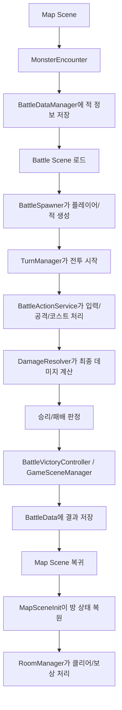

# ArrowHunter 프로젝트 코드 학습 문서

## 1. 문서 목적

이 문서는 현재 `ArrowHunter` 프로젝트의 **전체 코드 구조를 카테고리별로 정리한 학습용 해설서**다.

이 문서의 목표는 다음과 같다.

1. 지금까지 만든 코드가 **무슨 역할을 하는지** 이해한다.
2. 왜 이런 식으로 코드를 나눴는지 **설계 의도**를 파악한다.
3. 씬 전환, 전투, 맵, 보상, 아이템, 스킬, 상태이상, 성장 시스템이 **어떻게 연결되는지** 한 번에 본다.
4. 나중에 직접 리팩토링할 때, 어디를 먼저 봐야 하는지 **판단 기준**을 만든다.
5. 포트폴리오 설명이나 기술 블로그 작성 때, 시스템을 **자기 언어로 설명할 수 있게** 돕는다.

이 문서는 "코드를 대신 짜주는 문서"가 아니라, **네가 코드를 스스로 읽고 해석하는 기준점**이 되도록 작성했다.

---

## 2. 프로젝트 전체 한 줄 요약

이 프로젝트는 다음 흐름을 가진다.

`맵 탐색 -> 몬스터 조우 -> 배틀씬 전환 -> 턴제 전투 -> 승리 시 경험치/보상/방 상태 반영 -> 다시 맵 복귀`

핵심은 **씬이 나뉘어 있지만, 플레이어의 성장 상태는 `PlayerInstance` 하나가 계속 유지한다**는 점이다.

---

## 3. 전체 시스템 지도



---

## 4. 폴더 구조와 역할

### `Assets/02.Scripts/01_Common`
- 여러 시스템이 공통으로 쓰는 enum, 상수, 씬 전환 관리자

### `Assets/02.Scripts/02_Data`
- 전투/플레이어 상태를 유지하는 런타임 데이터
- 기본 스탯 SO, 플레이어 런타임 모델, 스탯 modifier 구조

### `Assets/02.Scripts/03_BattleSceneScripts`
- 배틀씬 전용 로직
- 턴 관리, 데미지 계산, 상태이상, 스킬, UI

### `Assets/02.Scripts/04_MapSceneScripts`
- 맵 탐색, 방 생성/복귀, 포탈 이동, 몬스터 조우, 인벤토리/스킬트리 UI

### `Assets/02.Scripts/05_Reward`
- 방 클리어 보상 시스템

### `Assets/02.Scripts/06_Item`
- 인벤토리, 장착 시스템, 아이템 효과 구조

### `Assets/02.Scripts/PlayerGrowth`
- 경험치 획득과 레벨업 처리

### `Assets/Editor`
- CSV를 읽어서 보상 SO를 자동 생성하는 에디터 도구

### `Assets/TutorialInfo`
- Unity 기본 튜토리얼용 Readme 에셋
- 게임 시스템과 직접 관련은 거의 없음

---

## 5. 가장 먼저 이해해야 할 중심 객체

### 5-1. `PlayerInstance`

이 프로젝트에서 가장 중요한 런타임 객체다.

역할:

- 플레이어의 현재 HP
- 레벨, 경험치, 스킬 포인트
- 해금된 스킬과 스킬 레벨
- modifier 기반 스탯 변화
- 인벤토리와 장비 상태

즉, `PlayerInstance`는 "플레이어의 현재 저장 상태 전체"라고 봐도 된다.

왜 중요하냐면:

- 맵 씬과 배틀 씬이 분리되어 있어도
- 플레이어의 성장, 장비, 보상 결과는 계속 유지되어야 하기 때문이다.

그래서 프로젝트는 `MonoBehaviour Player`를 영구 저장하지 않고, **plain C# class인 `PlayerInstance`를 영구 상태로 사용**한다.

### 5-2. `BattleDataManager`

`PlayerInstance`를 실제로 들고 있는 싱글톤 `MonoBehaviour`다.

역할:

- 게임 시작 시 `PlayerInstance` 생성
- 현재 적 정보 저장
- 맵 씬과 배틀 씬 사이에 필요한 상태 연결
- 플레이어 HP를 전투 종료 후 동기화

쉽게 말하면:

- `PlayerInstance`는 "실제 데이터"
- `BattleDataManager`는 "씬을 넘어 그 데이터를 들고 다니는 운반자"

### 5-3. `TurnManager`

배틀씬의 메인 관리자다.

역할:

- 플레이어/적 등록
- 전투 시작
- 현재 턴 상태 관리
- 플레이어 턴과 적 턴 전환
- 승리/패배 이벤트 발행

### 5-4. `RoomManager`

맵씬의 메인 관리자다.

역할:

- 현재 방 정보 유지
- 방문한 방 기록
- 방 오브젝트 재사용
- 포탈 상태 제어
- 방 클리어/보상 이벤트 발행

---

## 6. 코드 읽기 추천 순서

처음부터 모든 파일을 동일 비중으로 읽기보다, 아래 순서가 효율적이다.

1. `PlayerInstance`
2. `BattleDataManager`
3. `TurnManager`
4. `BattleActionService`
5. `DamageResolver`, `DamageContext`
6. `StatusHandler`, `StatusEffectSO`
7. `SkillSO`, `SkillExecutor`
8. `RoomManager`, `MapSceneInit`, `MonsterEncounter`
9. `Reward` / `Item`
10. UI와 Editor 도구

---

## 7. 카테고리별 상세 정리

# A. Common 계층

## A-1. `Assets/02.Scripts/01_Common/ClearCondition.cs`

### 역할
방 클리어 조건 enum.

### 값
- `KillAllMonsters`
- `TalkToNPC`
- `SelectReward`
- `None`

### 왜 분리했는가
방의 클리어 규칙을 `RoomSO` 데이터에서 설정하려면, if 문보다 enum이 적합하다.

---

## A-2. `Assets/02.Scripts/01_Common/Common.cs`

### 역할
공용 enum 모음.

### 포함 내용
- `Direction`
- `DurationRule`
- `StackRule`

### 핵심 의도
`Direction`은 맵 이동, 전투 입력, 포탈 방향, 스킬 입력 등 여러 시스템이 공유한다.

`DurationRule`, `StackRule`은 상태이상 설계를 데이터화하기 위해 사용한다.

예:
- 중첩은 되지만 지속시간은 갱신
- 중첩은 무시하지만 지속시간은 연장

---

## A-3. `Assets/02.Scripts/01_Common/ItemBattleEventType.cs`

### 역할
전투 중 아이템 효과가 반응할 수 있는 이벤트 종류를 정의한다.

### 값
- `BattleStart`
- `TurnStart`
- `TurnEnd`
- `BeforeDealDamage`
- `AfterDealDamage`
- `BeforeTakeDamage`
- `AfterTakeDamage`
- `CostRecovery`
- `DirectionInput`
- `StatusApplied`
- `StatusDamaged`

### 설계 이유
아이템 효과마다 함수를 새로 만드는 대신, **전투 중 이벤트를 공통 enum으로 묶어서** 처리하려는 구조다.

즉:
- "이 효과는 언제 발동하는가?"는 `eventType`
- "이 효과는 어떻게 계산하는가?"는 `ItemEffectSO` 파생 클래스

---

## A-4. `Assets/02.Scripts/01_Common/ItemBattleEventContext.cs`

### 역할
아이템 전투 이벤트에서 필요한 데이터를 한 묶음으로 전달한다.

### 주요 필드
- `eventType`
- `owner`
- `itemSource`
- `damageContext`
- `intValue`
- `direction`
- `statusType`

### 설계 이유
아이템 효과는 전투 중 여러 타이밍에 반응할 수 있다.
그때마다 함수 시그니처를 계속 늘리는 대신, **컨텍스트 객체 하나로 이벤트 정보를 전달**하려는 구조다.

---

## A-5. `Assets/02.Scripts/01_Common/Scene/SceneName.cs`

### 역할
씬 이름 상수 모음.

### 왜 필요한가
`SceneManager.LoadScene("MapScene")`처럼 문자열을 코드 곳곳에 직접 적으면 오타에 약하다.

상수로 묶어두면:
- 오타 위험 감소
- 씬 이름 변경 시 수정 범위 감소

---

## A-6. `Assets/02.Scripts/01_Common/Scene/GameSceneManager.cs`

### 역할
씬 전환 전용 싱글톤 관리자.

### 주요 기능
- `LoadMap`, `LoadStart`, `LoadBattle`, `LoadResult`
- 딜레이 후 씬 로드
- 결과 UI에서 키 입력 대기 후 씬 전환

### 현재 구조 특징
- `OnDefeat`만 구독 중
- `HandleVictory(int turnCount)` 메서드는 존재하지만 현재 이벤트 연결은 안 되어 있음

### 설계 의도
씬 전환을 여러 클래스에서 직접 하지 않고, 한 곳으로 모아두려는 목적이다.

### 관찰 포인트
현재는 승리 처리에서 `BattleVictoryController`가 `LoadMap()`을 직접 호출하므로, 전환 책임이 완전히 한 곳으로 모인 상태는 아니다.

---

# B. Data 계층

## B-1. `Assets/02.Scripts/02_Data/Runtime/BattleData.cs`

### 역할
씬 사이에서 한 번만 전달하면 되는 임시 상태를 저장하는 static 클래스.

### 예시
- 전투 결과
- 전투 턴 수
- 맵 복귀 위치
- 방 복귀 방향
- 처치한 적 정보
- 전투에서 얻은 경험치 결과

### `PlayerInstance`와 차이
- `PlayerInstance`: 장기 상태
- `BattleData`: 씬 전환 시 잠깐 전달하는 단기 상태

---

## B-2. `Assets/02.Scripts/02_Data/Runtime/BattleDataManager.cs`

### 역할
플레이어 장기 상태와 현재 전투 대상 상태를 보관하는 싱글톤.

### 핵심 필드
- `playerStatSO`
- `PlayerInstance`
- `CurrentEnemyStat`
- `IsBossBattle`

### 전투 진입 흐름
1. 맵에서 `MonsterEncounter`
2. `MonsterEncounter.OnEncountMonster`
3. `BattleDataManager.SetBattleData`
4. 배틀씬 전환

### 설계 이유
맵 씬과 배틀 씬이 분리되어 있어도 **현재 플레이어 상태와 현재 적 상태를 안정적으로 전달**하기 위함.

---

## B-3. `Assets/02.Scripts/02_Data/Stats/BaseStatSO.cs`

### 역할
플레이어/적의 기본 설계 데이터를 담는 ScriptableObject.

### 들어가는 데이터
- 이름
- 프리팹
- 최대 HP
- 방향별 공격력
- 방어력
- 코스트 관련
- 상태이상 관련 능력치
- 배율
- 경험치 보상
- 스킬트리

### 설계 이유
전투용 수치를 코드에 박지 않고, 에셋 데이터로 분리하기 위해서다.

---

## B-4. `Assets/02.Scripts/02_Data/Stats/DirectionalInt.cs`

### 역할
상/하/좌/우 값을 하나의 구조체로 묶는다.

### 왜 필요한가
공격력이 방향별로 다르기 때문에, `upAttack`, `downAttack`, `leftAttack`, `rightAttack`를 여러 파일에 흩뿌리기보다 구조체로 관리한다.

### 제공 기능
- `Get(Direction)`
- `Set(Direction, value)`

---

## B-5. `Assets/02.Scripts/02_Data/Stats/StatModifier.cs`

### 역할
스탯에 추가되는 보정값 하나를 표현한다.

### 주요 개념
- `StatType`
- `ModifierMode`
- `value`
- `duration`
- `sourceId`

### 왜 중요한가
리워드, 레벨업, 아이템, 임시 효과를 모두 **같은 스탯 보정 구조로 통합**할 수 있게 해준다.

---

## B-6. `Assets/02.Scripts/02_Data/Stats/StatType.cs`

### 역할
modifier가 어떤 스탯에 영향을 주는지 정의하는 enum.

### 특징
단순 공격력/방어력뿐 아니라:
- 방향별 공격
- 전체 공격 flat/percent
- 상태이상 관련 multiplier
- 콤보 데미지
- 받는 피해량
까지 포함한다.

### 설계 이유
modifier 시스템을 확장성 있게 만들기 위해서다.

---

## B-7. `Assets/02.Scripts/02_Data/Stats/PlayerGrowthSO.cs`

### 역할
레벨업 성장 규칙 정의.

### 담당 내용
- 레벨별 필요 경험치
- 레벨업 시 주는 modifier

### 설계 의도
경험치 공식과 성장 보너스를 코드에서 분리하려는 것.

---

## B-8. `Assets/02.Scripts/02_Data/Stats/PlayerInstance.cs`

### 역할
플레이어의 현재 상태 전체를 담는 핵심 런타임 모델.

### 큰 책임 1: 생존/성장 상태
- HP
- 레벨
- 경험치
- 스킬 포인트

### 큰 책임 2: 전투 스탯 계산
- 공격력
- 방어력
- 상태이상 위력
- 배율

### 큰 책임 3: 스킬 상태
- 해금된 스킬 목록
- 각 스킬의 현재 레벨

### 큰 책임 4: 아이템 상태
- `PlayerInventory`
- `EquipmentSlot`

### 중요한 메서드 묶음

#### 스탯 계산
- `GetAttack(Direction dir)`
- `GetAverageAttack()`
- `GetSkillPowerValue()`
- `GetStatusPowerValue()`
- `GetStat(StatType type)`

#### modifier 처리
- `AddModifier`
- `AddModifiers`
- `RemoveModifiersBySource`

#### 성장 처리
- `AddExpRaw`
- `SpendExp`
- `LevelUp`

#### 스킬 처리
- `UnlockSkill`
- `UpgradeSkill`
- `GetSkillInstance`
- `UnlockSkillsByCurrentLevel`

#### 아이템 중간 창구
- `RequestEquipItem`
- `RequestUnequipItem`
- `GetItem`
- `DropItem`
- `DispatchItemBattleEvent`

### 왜 plain class인가
`PlayerInstance`는 Unity 씬 오브젝트가 아니라 **게임 상태 모델**이기 때문이다.

장점:
- 씬에 종속되지 않음
- 직렬화/저장 구조 확장 쉬움
- 테스트와 리팩토링 용이

### 설계적으로 아주 중요한 점
이 클래스는 "플레이어를 표현하는 모델"이라서 편리하지만, 책임이 많다.

현재 상태:
- 스탯 계산
- 스킬
- 레벨
- 아이템
를 다 가지고 있다.

즉 프로젝트가 커지면, 나중에 가장 먼저 리팩토링 후보가 될 가능성이 큰 클래스이기도 하다.

---

# C. Battle 계층

## C-1. Cost

### `Assets/02.Scripts/03_BattleSceneScripts/Cost/CostHandler.cs`

#### 역할
전투 중 현재 코스트를 관리한다.

#### 담당
- 코스트 사용 가능 여부
- 코스트 소모
- 턴 종료 코스트 회복
- 방어 성공 보너스 반영

#### 설계 의도
코스트 로직을 `TurnManager`나 `BattleActionService`에서 분리해서, 책임을 줄이기 위함.

---

## C-2. Damage

### `Assets/02.Scripts/03_BattleSceneScripts/Damage/DamageContext.cs`

#### 역할
데미지 계산에 필요한 정보를 모아 놓은 컨텍스트 객체.

#### 포함 정보
- 공격자/피격자
- 데미지 타입
- 방향
- 콤보 여부
- 현재 damage
- 현재 defensePower
- 계산 phase
- 방어력 적용 여부
- modifier 적용 여부

#### 왜 필요한가
데미지는 단순히 `공격력 - 방어력`이 아니라,
- 상태이상
- 아이템
- 방어력
- 받는 피해 증가
- 스킬 데미지
가 모두 개입할 수 있다.

그래서 계산 중간값을 계속 수정할 수 있는 `DamageContext`가 필요하다.

---

### `Assets/02.Scripts/03_BattleSceneScripts/Damage/DamageResolver.cs`

#### 역할
`DamageContext`를 받아서 최종 데미지를 계산하고 적용하는 정적 계산기.

#### 계산 흐름
1. `BeforeDefense`
2. 공격자 상태이상 modifier 적용
3. 방어력 계산
4. 피격자 상태이상 modifier 적용
5. `DamageTakenMultiplier` 적용
6. 최종 int 데미지 반환

#### 팩토리 메서드
- `CreateBasicAttack`
- `CreateSkillDamage`
- `CreateStatusDamage`

#### 설계 의도
데미지 계산을 중앙화해서,
- 기본 공격
- 스킬
- 상태이상 데미지
가 같은 파이프라인을 타게 만들려는 것.

#### 현재 코드에서 보는 포인트
아이템 effect는 `DamageResolver` 내부가 아니라 `BattleActionService` 쪽에서 미리 `DispatchItemBattleEvent`를 호출하는 구조다.

즉 현재 구조는:
- 상태이상 = `DamageResolver` 안에서 개입
- 아이템 = `DamageResolver` 호출 전에 개입

---

## C-3. Entity

### `Assets/02.Scripts/03_BattleSceneScripts/Entity/BattleEntity.cs`

#### 역할
배틀씬에 존재하는 실제 전투 오브젝트의 공통 래퍼.

#### 중요 개념
이 클래스는 **적도 쓸 수 있고 플레이어도 쓸 수 있다.**

플레이어일 때:
- `PlayerInstance` 참조를 가짐
- 동적 스탯을 런타임에서 읽음

적일 때:
- `BaseStatSO` 값만 사용

#### 핵심 장점
전투 계산 쪽에서는 "이게 플레이어냐 적이냐"를 크게 구분하지 않고도,
- 공격력
- 방어력
- HP
- 상태이상 처리
를 공통 인터페이스처럼 다룰 수 있다.

---

### `EnemyController.cs`

#### 역할
적의 방향 선택 담당.

현재는 랜덤 방향만 고른다.

즉 나중에 AI나 패턴 시스템을 붙일 때, 이 클래스 또는 그 상위 로직이 확장 포인트가 된다.

---

### `PlayerCombatController.cs`

#### 역할
플레이어의 방향 입력을 읽는다.

현재는 화살표 입력을 `Direction`으로 바꾸는 단순한 입력 어댑터다.

---

## C-4. Flow

### `BattleRuntime.cs`

#### 역할
현재 전투에 필요한 실제 레퍼런스를 묶는다.

예:
- 플레이어 `BattleEntity`
- 적 `BattleEntity`
- 플레이어 컨트롤러
- 적 컨트롤러

#### 왜 필요한가
`TurnManager`, `BattleActionService`가 개별 객체들을 따로 들고 다니지 않게 하기 위해서다.

---

### `BattleState.cs`

#### 역할
턴 상태 클래스들의 추상 베이스.

#### 의미
플레이어 턴과 적 턴을 상태 패턴 비슷하게 관리하려는 구조다.

---

### `PlayerAttackState.cs`

#### 역할
플레이어 턴의 입력 상태.

#### 처리
- `Space`: 스킬 입력 시작/확정
- `Z`: 콤보 포기 또는 턴 종료
- 방향키: 공격/입력

#### 설계 의도
현재 턴이 플레이어 차례일 때만 입력을 처리하게 하려는 것.

---

### `EnemyTurnState.cs`

#### 역할
적 턴 상태.

#### 처리
- 적 공격 방향 미리 선택
- 플레이어의 방어 입력 대기

---

### `BattleResolver.cs`

#### 역할
공격 성공 여부 판정.

현재 규칙:
- 공격 방향과 방어 방향이 다르면 성공

이 프로젝트 전투의 가장 기본 규칙을 담당하는 작은 클래스다.

---

### `BattleResult.cs`

#### 역할
공격 성공/실패 결과 래퍼.

현재는 `bool success`만 있지만, 나중에 확장 여지가 있다.

---

### `BattleActionService.cs`

#### 역할
실제 전투 행동의 대부분을 담당하는 서비스 계층.

#### 매우 중요한 책임
- 플레이어 일반 공격
- 플레이어 스킬 사용
- 콤보 처리
- 적 공격 처리
- 코스트 소모/회복
- 상태이상 입력 개입
- 아이템 전투 이벤트 호출

#### 구조상 의미
`TurnManager`가 전투 전체를 관리한다면,
`BattleActionService`는 실제 세부 행위를 실행하는 실무 담당자다.

#### 주요 흐름

##### 플레이어 공격
1. 방향 입력
2. 상태이상이 입력을 수정할 수 있음
3. 코스트 소모
4. 적 방어 방향 설정
5. 성공 시 `DamageContext` 생성
6. 아이템 이벤트 `BeforeDealDamage`
7. `DamageResolver.Apply`
8. 콤보 가능 여부 판단

##### 적 공격
1. 적 방향 선택
2. 플레이어 방어 입력
3. 성공/실패 판정
4. 실패 시 데미지 적용
5. 성공 시 방어 보너스 표시
6. 턴 종료 후 코스트 회복

#### 설계 장점
- 턴 상태와 세부 행동이 분리됨
- 이후 스킬/아이템/상태이상 확장이 쉬움

#### 현재 관찰 포인트
- 적 턴 종료 후 `RecoverOnTurnEnd` 호출에서 방어 성공 보너스 값으로 `turnCount`를 넘기고 있어 보인다.
- 이 부분은 나중에 네가 직접 코드 읽으면서 검증해볼 가치가 있는 지점이다.

---

### `TurnManager.cs`

#### 역할
배틀씬의 최고 관리자.

#### 담당
- 런타임 준비 여부 확인
- 플레이어/적 등록
- 배틀 시작
- 현재 상태 객체 실행
- 승리/패배 이벤트 발행

#### 전투 시작 순서
1. `BattleSpawner`가 플레이어와 적 생성
2. `TurnManager.RegisterPlayer/RegisterEnemy`
3. 두 객체가 모두 준비되면 `TryStartBattle`
4. 플레이어 스킬 목록 초기화
5. `BattleActionService.Initialize`
6. `PlayerAttackState` 진입

#### 설계 이유
배틀씬의 "상태 머신 + 전역 이벤트 중심" 허브 역할을 맡기기 위해서다.

---

### `BattleSpawner.cs`

#### 역할
배틀씬에 플레이어와 적 프리팹을 실제로 생성한다.

#### 데이터 출처
- 플레이어: `BattleDataManager.playerStatSO`
- 적: `BattleDataManager.CurrentEnemyStat`

즉 전투씬은 스스로 누가 적인지 모르고, 외부 데이터에서 받아온다.

---

### `BattleVictoryController.cs`

#### 역할
전투 승리 후 후처리 담당.

#### 흐름
1. 적 사망 -> `TurnManager.OnVictory`
2. 플레이어 HP 동기화
3. 경험치 지급
4. `BattleData.SetBattleVictory`
5. 승리 UI 표시
6. 맵 씬 복귀

#### 설계 의도
승리 후의 복합 작업을 `TurnManager`에서 떼어내기 위한 것.

---

## C-5. Skill

### `SkillSO.cs`

#### 역할
스킬 설계 데이터.

#### 포함 내용
- `skillId`
- 이름
- 아이콘
- 입력 커맨드
- 최대 레벨
- 레벨별 데이터

#### 중요한 구조
`SkillLevelData`

이 안에:
- 레벨
- cost
- 설명
- 효과 리스트
가 들어 있다.

즉 스킬은 "스킬 하나 + 레벨별 상세 데이터" 구조다.

---

### `PlayerSkillInstance.cs`

#### 역할
플레이어가 실제로 가진 스킬의 런타임 상태.

#### 왜 필요한가
`SkillSO`는 원본 데이터일 뿐이고,
플레이어는 그 스킬을 몇 레벨로 가지고 있는지 별도 관리해야 한다.

즉:
- `SkillSO` = 설계도
- `PlayerSkillInstance` = 플레이어가 실제로 가진 스킬

---

### `JobSkillTreeSO.cs`

#### 역할
직업별 스킬 해금 테이블.

#### 구조
`SkillUnlockData`
- `unlockLevel`
- `skill`

#### 의미
이 직업은 몇 레벨에 어떤 스킬을 배우는가를 정의한다.

---

### `InputBuffer.cs`

#### 역할
스킬 커맨드 입력 버퍼.

#### 기능
- 스킬 입력 시작
- 입력 누적
- 특정 커맨드와 매칭
- 버퍼 문자열 출력

#### 설계 이유
`↑↓←` 같은 입력 조합 기반 스킬을 처리하기 위해서다.

---

### `SkillExecutor.cs`

#### 역할
입력 버퍼를 사용해서 실제로 발동할 스킬을 찾는다.

#### 핵심 흐름
- `Space` 누르면 입력 시작 또는 확정
- 방향 입력이 들어오면 버퍼에 저장
- 스킬 목록과 버퍼를 비교해서 일치하는 스킬 반환

#### 구조 의미
전투 입력 처리와 스킬 매칭 로직을 분리했다.

---

### `SkillEffectSO.cs`

#### 역할
스킬 효과의 공통 베이스 클래스.

#### 설계 철학
스킬 자체가 모든 일을 하지 않고, **효과를 모듈처럼 붙이는 구조**다.

즉:
- 데미지 효과
- 상태이상 부여 효과
를 조합할 수 있다.

---

### `DamageEffect.cs`

#### 역할
스킬 데미지 효과.

#### 처리
- `DamageResolver.CreateSkillDamage`
- `DamageResolver.Apply`

#### 데이터화된 옵션
- 방어력 적용 여부
- outgoing/incoming modifier 여부
- damageTakenMultiplier 적용 여부

즉 스킬마다 계산 방식을 다르게 줄 수 있게 해둔 구조다.

---

### `ApplyStatusEffect.cs`

#### 역할
스킬이 상태이상을 부여하게 만드는 효과.

#### 처리
- 대상 `statusHandler.Apply(...)`

#### 장점
스킬 하나에 데미지와 상태이상을 동시에 붙일 수 있다.

---

## C-6. Status

### `StatusType.cs`

#### 역할
상태이상 식별용 enum.

현재:
- `Stun`
- `Burn`
- `Poison`
- `Bleed`
- `Freeze`
- `Paralyze`

---

### `StatusEffectInstance.cs`

#### 역할
실제 전투 중 걸린 상태이상의 런타임 상태.

#### 포함
- 어떤 SO인지
- 누가 걸었는지
- 남은 턴
- 현재 스택
- magnitude
- intValue
- 저장된 방향

#### 설계 이유
SO는 원본 데이터이므로, 남은 턴/현재 스택 같은 정보는 별도 인스턴스로 관리해야 한다.

---

### `StatusEffectSO.cs`

#### 역할
모든 상태이상 효과의 베이스 클래스.

#### 제공 훅
- `OnApply`
- `OnRemove`
- `OnTurnStart`
- `OnTurnEnd`
- `OnDirectionInput`
- `OnStack`
- `ModifyIncomingDamage`
- `ModifyOutgoingDamage`
- `ModifyCostRecovery`
- `ModifyDefensePower`
- `ModifyDirectionInput`
- `ModifyDamage`

#### 왜 이렇게 많은가
상태이상은 단순 DOT가 아니라:
- 입력 방해
- 피해 증가
- 방어력 감소
- 행동불능
등 여러 방식으로 전투에 개입할 수 있기 때문이다.

---

### `StatusHandler.cs`

#### 역할
한 `BattleEntity`에 걸린 상태이상 목록을 관리한다.

#### 핵심 책임
- 적용
- 중첩/지속시간 처리
- 턴 경과
- 만료
- 입력/데미지/방어력/코스트 수정

#### 구조상 매우 중요
전투 중 상태이상 관련 처리는 대부분 이 클래스를 거친다.

즉 `BattleEntity.statusHandler`는 상태이상 전용 서브시스템이다.

---

### `DirectionInputResult.cs`

#### 역할
상태이상이 방향 입력을 수정할 때 쓰는 결과 객체.

#### 포함 정보
- 성공/실패
- 코스트 소모 여부
- 스킬 버퍼 취소 여부
- 턴 종료 여부
- 실패 이유

#### 설계 이유
입력 실패에도 규칙이 다르기 때문이다.

예:
- 동결: 방향만 막기
- 마비: 입력 실패 + 코스트 소모 + 스킬 취소

---

### `BurnEffectSO.cs`

#### 역할
화상 상태이상.

#### 특징
- 턴 종료 시 상태이상 데미지
- 방어력 감소 효과를 `ModifyDamage`에서 적용

#### 설계 포인트
단순 DOT가 아니라, 맞는 동안 더 아프게 만드는 디버프 역할도 겸한다.

---

### `PoisonEffectSO.cs`

#### 역할
최대 HP 비례 지속 데미지.

#### 특징
- 적용 시 `magnitude = ratio`
- 턴 종료 시 `owner.GetMaxHp() * ratio`
- 중첩 시 비율 증가

#### 설계 의미
고정 데미지가 아니라 비율 기반으로 설계해서 탱커/유리몸 모두에게 의미가 생긴다.

---

### `BleedEffectSO.cs`

#### 역할
방향 입력 시 추가 피해를 주는 상태이상.

#### 특징
- 공격자 상태이상 위력 기반 magnitude 계산
- `OnDirectionInput` 시 발동
- 방어력/피해증가 적용 가능하도록 `CreateStatusDamage(..., useIncomingModifiers: true, useDefense: true)`

#### 설계 의미
턴 종료 DOT가 아니라 **입력 기반 트리거형 상태이상**이라는 점에서 독/화상과 다르다.

---

### `FreezeEffectSO.cs`

#### 역할
랜덤 방향 봉인.

#### 특징
- 적용 시 방향 하나 저장
- 그 방향 입력은 실패 처리

---

### `ParalyzeEffectSO.cs`

#### 역할
확률적으로 입력 실패.

#### 특징
- 실패 시 코스트 소모
- 스킬 버퍼 취소

---

### `StunEffectSO.cs`

#### 역할
현재는 빈 구현이지만, `isActionDisable` 플래그와 함께 행동불능 역할을 할 것으로 보이는 구조.

---

### `VulnerableEffectSO.cs`

#### 역할
받는 피해 증가 상태이상.

#### 처리
- `AfterDefense` 단계에서 damage 증폭

---

## C-7. Battle UI

### `BattleUIManager.cs`

#### 역할
전투 UI 표시.

#### 담당
- HP 바 갱신
- 현재 코스트 표시
- 승리 패널
- 패배 패널

#### 특징
현재는 `Update()`에서 계속 HP/코스트를 읽어와서 갱신한다.

이벤트 기반 UI가 아니라 polling 기반 UI다.

---

### `ResultSceneUI.cs`

#### 역할
결과 씬 UI.

#### 표시 내용
- Victory / Defeat
- 생존 턴 수
- 아무 버튼으로 처음으로 돌아가기

---

# D. Map 계층

## D-1. Monster

### `MonsterEncounter.cs`

#### 역할
맵에서 몬스터와 접촉했을 때 배틀씬으로 넘기는 트리거.

#### 흐름
1. 플레이어 충돌
2. 현재 위치 저장
3. `OnEncountMonster` 이벤트 발행
4. 배틀씬 로드

#### 설계 이유
맵 상 몬스터 오브젝트는 전투 시스템을 직접 몰라도 되고, "충돌 -> 이벤트 발행"만 하면 된다.

---

### `MonsterSpawner.cs`

#### 역할
방 내부에 몬스터를 스폰한다.

#### 특징
- 방의 `RemainingMonsters`를 기준으로 스폰
- 최소 거리 유지
- 보스 여부 전달

#### 설계 의미
방 데이터와 실제 맵 오브젝트 생성이 분리되어 있다.

---

## D-2. Player

### `MapPlayerController.cs`

#### 역할
맵 이동 담당.

#### 특징
- 카메라 기준 이동
- Rigidbody 기반
- 방 생성 직후 일정 시간 이동 잠금

#### 설계 이유
카메라 튐 현상이나 방 전환 직후 위치 꼬임을 막기 위해서다.

---

## D-3. Interaction

### `InteractionSystem.cs`

#### 역할
범위 안의 상호작용 오브젝트를 찾고 `E` 입력으로 실행한다.

#### 구조
- `IInteractable` 인터페이스 기반

#### 설계 이유
상점, NPC, 이벤트 오브젝트 같은 것들을 공통 방식으로 붙이기 위함.

---

## D-4. Room 데이터 구조

### `RoomType.cs`

#### 역할
방 타입 enum.

값:
- `Start`
- `Common`
- `Elite`
- `Event`
- `Shop`
- `Boss`

---

### `RoomSO.cs`

#### 역할
방 설계 데이터.

#### 포함
- 방 타입
- 클리어 조건
- 크기
- 열린 방향
- 몬스터 구성
- 보스 여부
- 방 프리팹

#### 설계 포인트
맵 방도 ScriptableObject 기반 데이터로 관리하려는 구조다.

---

### `RoomInstance.cs`

#### 역할
실제 게임 중 존재하는 방의 런타임 상태.

#### 포함
- 어떤 `RoomSO` 기반인지
- 격자 좌표
- 월드 좌표
- 클리어 여부
- 보상 수령 여부
- 남은 몬스터 목록

#### 설계 이유
SO는 원본 데이터이고, 방마다 남은 몬스터 수/클리어 여부는 런타임 상태이므로 분리해야 한다.

---

## D-5. Room 시스템

### `RoomGenerator.cs`

#### 역할
다음 방 타입과 SO를 뽑는다.

#### 현재 상태
난이도 관련 변수는 있지만, `RollTileType()`이 현재 `Common`을 고정 반환하고 있다.

즉 구조는 준비됐지만 아직 본격 랜덤 생성은 시작 전 단계다.

---

### `PortalController.cs`

#### 역할
포탈의 열림/닫힘 상태 제어 및 이동 트리거.

#### 처리
- `SetLocked()`
- `SetOpen()`
- 플레이어 충돌 시 `RoomManager.MoveToRoom`

---

### `RoomManager.cs`

#### 역할
맵 방 시스템의 핵심 관리자.

#### 매우 중요한 책임
- 현재 방 유지
- 방문한 방 기록
- 방 오브젝트 캐싱
- 포탈 연결
- 방 이동
- 방 클리어 처리
- 보상 이벤트 발행

#### 핵심 자료구조
- `_visitedRooms : Dictionary<Vector2Int, RoomInstance>`
- `_roomObjects : Dictionary<Vector2Int, GameObject>`

#### 설계 이유
맵 씬은 방을 매번 새로 생성하기보다, 방문한 방을 기억하고 필요 시 다시 켜는 구조로 가려는 의도다.

#### 중요 이벤트
- `OnRoomChanged`
- `OnRoomClearedEvent`

#### 관찰 포인트
소스 파일 주석 일부가 인코딩 깨짐 상태로 보인다.
나중에 정리할 때 UTF-8로 정리해두면 좋다.

---

### `MapSceneInit.cs`

#### 역할
맵 씬이 시작되거나 방이 바뀔 때, 실제 방과 플레이어 위치를 세팅하는 초기화 담당.

#### 흐름
1. 현재 방 생성 또는 재활성화
2. `RoomManager.RegisterRoomObject`
3. 전투 승리 복귀 시 몬스터 처치 반영
4. 플레이어 위치 설정
5. 몬스터 스폰
6. 이동 잠금

#### 설계 이유
맵 씬 초기 진입/전투 복귀/방 전환의 공통 초기화 로직을 모아두기 위해서다.

---

## D-6. Map UI

### `InventoryUI.cs`

#### 역할
현재 인벤토리/장비창 통합 UI.

#### 담당
- 보유 아이템 목록 표시
- 선택 아이템 상세 표시
- 장착/해제 버튼 처리
- 현재 장착 장비 텍스트 표시

#### 현재 상태
장비 슬롯은 아이콘이 아니라 텍스트 기반이다.
즉 아직 UI 1차 버전으로 보는 게 맞다.

#### 핵심 함수
- `RefreshAll`
- `RefreshItemList`
- `RefreshDetail`
- `RefreshButtons`
- `RefreshEquippedSlots`

#### 설계 의미
UI도 "전체 갱신"이 아니라 구역별로 refresh하는 형태로 나누어져 있어서, 나중에 리팩토링하기 좋다.

---

### `InventoryItemSlotUI.cs`

#### 역할
인벤토리 리스트의 아이템 한 칸 UI.

#### 처리
- 아이콘
- 이름
- 수량
- 장착중 표기
- 클릭 시 부모에 선택 전달

---

### `SkillTreeUI.cs`

#### 역할
스킬트리 전체 UI 관리자.

#### 흐름
- 플레이어의 직업 스킬트리 읽기
- 해금 레벨별 줄 생성
- 줄마다 스킬 버튼 생성
- 클릭 시 스킬 해금 또는 업그레이드

#### 설계 이유
씬에 미리 모든 스킬 슬롯을 두지 않고, **데이터 기반으로 동적 생성**하려는 구조다.

---

### `SkillLevelLineUI.cs`

#### 역할
스킬트리의 한 레벨 줄 UI.

예:
- `Lv.1`
- `Lv.3`
- `Lv.5`

---

### `SkillUI.cs`

#### 역할
스킬트리 안의 개별 스킬 노드 UI.

#### 표시
- 아이콘
- 현재 레벨 또는 해금 레벨
- 잠금 오버레이

---

# E. Reward 계층

## E-1. `RewardRarity.cs`

보상 희귀도 enum.

---

## E-2. `RewardEffectSO.cs`

보상 효과 공통 베이스 클래스.

구조:
- `Apply(PlayerInstance player, RewardSO source)`

---

## E-3. `StatModifierRewardEffectSO.cs`

리워드가 플레이어에게 스탯 modifier를 주는 효과.

설계 의미:
보상도 결국 `StatModifier` 시스템에 탑승한다.

즉 레벨업, 아이템, 보상이 같은 스탯 시스템을 공유한다는 점이 중요하다.

---

## E-4. `RewardSO.cs`

보상 카드 데이터.

포함:
- 이름
- 설명
- 아이콘
- 희귀도
- 효과 리스트

---

## E-5. `RewardPoolSO.cs`

보상 후보군과 희귀도 가중치 관리.

### 핵심 특징
먼저 희귀도를 가중치로 뽑고,
그 다음 그 희귀도 안에서 보상을 고른다.

### 왜 좋은가
보상 개수가 늘어나도 "희귀도 등장 확률"을 독립적으로 유지할 수 있다.

즉 단순 랜덤보다 밸런스 설계에 유리하다.

---

## E-6. `RewardCardUI.cs`

보상 카드 한 장 UI.

---

## E-7. `RewardSelectionUI.cs`

보상 선택 패널.

역할:
- 패널 열기
- 카드들 세팅
- 선택 콜백 전달

---

## E-8. `RoomRewardController.cs`

방 클리어 후 보상 표시/적용 담당.

흐름:
1. `RoomManager.OnRoomClearedEvent`
2. 보상 후보 뽑기
3. UI 표시
4. 선택 시 적용
5. `rewardClaimed = true`

---

# F. Item 계층

## F-1. `ItemType.cs`

아이템 부위/종류 enum.

현재:
- `Weapon`
- `Helmet`
- `Armor`
- `Gloves`
- `Pants`
- `Shoes`
- `Pendant`
- `Ring`
- `Potion`

---

## F-2. `ItemSO.cs`

아이템 설계 데이터.

포함:
- 이름
- 희귀도 문자열
- 아이콘
- 설명
- ID
- 세트 ID
- 효과 리스트
- 타입

### 설계 의도
아이템 데이터와 아이템 효과를 분리하기 위함.

---

## F-3. `PlayerItemInstance.cs`

플레이어가 가진 아이템 한 개의 런타임 상태.

포함:
- 어떤 `ItemSO`인지
- `instanceId`
- 수량
- 저장 방향
- 장착 여부

### 중요한 점
같은 이름의 장비라도 **각각 독립 인스턴스**로 관리할 수 있게 한다.

---

## F-4. `PlayerInventory.cs`

플레이어가 가진 전체 아이템 목록 관리자.

#### 담당
- 아이템 획득
- 수량 증가
- 삭제
- 중첩 가능 여부 판정

#### 현재 규칙
- 포션만 중첩
- 장비는 개별 인스턴스

#### 설계 이유
장비는 나중에 강화, 개별 옵션, 장착 여부 등이 붙을 수 있으므로 수량 하나로 묶지 않는 편이 자연스럽다.

---

## F-5. `EquipmentSlot.cs`

장착 중인 아이템 관리자.

### 핵심 자료구조
- `Dictionary<ItemType, PlayerItemInstance>`

### 담당
- 장착
- 해제
- 기존 장비 교체
- 장착 효과 적용/제거
- 전투 중 아이템 이벤트 전달

### 설계 의도
Inventory와 Equipment를 분리해서:
- 소유
- 사용 중
을 구분하려는 것.

---

## F-6. `ItemEffectSO.cs`

아이템 효과의 공통 베이스 클래스.

현재 훅:
- `OnEquip`
- `OnUnequip`
- `HandleBattleEvent`

### 설계 의미
전투 중 아이템 효과를 함수 여러 개가 아니라 **공통 전투 이벤트 디스패치 구조**로 가려는 방향이다.

---

## F-7. `StatModifierItemEffectSO.cs`

장착 시 고정 스탯을 올리는 아이템 효과.

예:
- 공격력 +5
- 방어력 +3

### 처리
- 장착 시 `AddModifier`
- 해제 시 `RemoveModifiersBySource`

### 중요한 설계 포인트
아이템 인스턴스별 `sourceId`를 써서, 같은 종류의 장비 여러 개가 있어도 개별적으로 해제 가능하게 한다.

---

## F-8. `ChanceDamageBonusItemEffectSO.cs`

전투 이벤트 기반 확률 발동 아이템 효과.

현재 예:
- 공격 시 확률적으로 데미지 증가

### 구조 의미
고정 수치 장착형이 아니라, 전투 이벤트 반응형 아이템의 첫 예시다.

---

## F-9. `ItemTest.cs`

디버그 테스트용 스크립트.

역할:
- 키 입력으로 아이템 지급
- 인벤토리 출력
- 첫 장비 장착/해제
- 공격력 확인

### 설계 의미
UI 없이도 아이템 루프를 검증하기 위한 임시 도구다.

---

# G. PlayerGrowth

## G-1. `PlayerProgressionService.cs`

### 역할
적 처치 경험치 지급 및 레벨업 처리.

### 흐름
1. 적 경험치 읽기
2. 플레이어 EXP 증가
3. 필요 경험치 이상이면 반복 레벨업
4. 스킬 포인트 지급
5. 현재 레벨 해금 스킬 자동 해금
6. 성장 modifier 부여
7. `ProgressionResult` 반환

### 설계 이유
레벨업 로직을 `PlayerInstance` 내부에 전부 밀어 넣지 않고, 서비스 계층으로 분리하려는 구조다.

---

# H. Editor / Utility

## H-1. `Assets/Editor/RewardCsvImporter.cs`

### 역할
CSV로 작성한 Reward / RewardEffect 데이터를 읽어서 SO 에셋을 자동 생성하거나 갱신한다.

### 주요 처리
- `RewardEffects.csv` 읽기
- modifier 그룹핑
- `StatModifierRewardEffectSO` 생성/갱신
- `Rewards.csv` 읽기
- `RewardSO` 생성/갱신
- `RewardPoolSO`에 pool 등록

### 왜 중요한가
데이터 양이 늘어나면 Unity 인스펙터에서 수동으로 보상 에셋을 만드는 방식이 비효율적이기 때문이다.

즉 이 파일은 "콘텐츠 생산성"을 높여주는 도구다.

---

# I. TutorialInfo

## I-1. `Readme.cs`
Unity 기본 튜토리얼 표시용 ScriptableObject.

## I-2. `ReadmeEditor.cs`
위 Readme 에셋을 에디터 창에서 예쁘게 보여주는 커스텀 에디터.

### 프로젝트 관점
게임 시스템 본체와는 무관하다.
문서에는 존재만 알고 있으면 충분하다.

---

## 8. 시스템 간 연결 구조 정리

### 8-1. 맵 -> 전투 진입

1. 맵에서 `MonsterEncounter` 충돌
2. `BattleDataManager.SetBattleData`
3. `BattleData.playerMapPosition` 저장
4. `GameSceneManager.LoadBattle`
5. 배틀씬에서 `BattleSpawner`
6. `TurnManager`가 전투 시작

### 8-2. 전투 -> 맵 복귀

1. 적 사망
2. `TurnManager.OnVictory`
3. `BattleVictoryController`
4. 경험치 계산
5. `BattleData.SetBattleVictory`
6. 맵 씬 로드
7. `MapSceneInit`가 방 복원
8. `RoomManager.MarkCurrentRoomMonsterDefeated`

### 8-3. 리워드 적용

1. 방 클리어
2. `RoomRewardController`
3. `RewardSelectionUI`
4. `RewardSO.Apply`
5. `RewardEffectSO.Apply`
6. `PlayerInstance.AddModifier`

### 8-4. 아이템 적용

1. 아이템 획득
2. `PlayerInventory.ObtainItem`
3. 장착 요청
4. `EquipmentSlot.EquipItem`
5. `ItemEffectSO.OnEquip`
6. 전투 중 필요 시 `DispatchBattleEvent`
7. `ItemEffectSO.HandleBattleEvent`

---

## 9. 이 프로젝트의 설계 철학

### 9-1. ScriptableObject 중심 데이터 설계

많은 요소가 SO 기반이다.

예:
- 캐릭터 기본 스탯
- 방 데이터
- 스킬
- 상태이상
- 보상
- 아이템 효과

이 방향의 장점:
- 데이터 변경이 쉬움
- 디자이너 친화적
- 직렬화 편함

### 9-2. 런타임 상태는 Instance 클래스로 분리

예:
- `PlayerInstance`
- `PlayerSkillInstance`
- `StatusEffectInstance`
- `PlayerItemInstance`
- `RoomInstance`

이 패턴은 매우 중요하다.

원본 데이터와 현재 상태를 섞지 않기 위해서다.

### 9-3. 공통 modifier 시스템 사용

리워드, 레벨업, 장비가 모두 `StatModifier`에 탑승한다.

이건 꽤 좋은 구조다.

이유:
- 시스템이 늘어나도 스탯 적용 방식이 통일됨
- 디버깅 포인트가 줄어듦

### 9-4. 씬은 분리되지만 상태는 분리되지 않음

맵 씬과 배틀 씬은 나뉘어 있지만:
- 플레이어 성장 상태
- 아이템
- 스킬
- 경험치
는 같은 `PlayerInstance`로 유지된다.

---

## 10. 현재 코드 기준으로 보이는 장점

1. 전투, 맵, 보상, 아이템이 이미 큰 축으로 분리되어 있다.
2. SO 기반이라 콘텐츠 추가에 유리하다.
3. 상태이상/스킬/아이템 효과를 모듈형으로 만들려는 방향이 좋다.
4. `PlayerInstance` 중심 구조 덕분에 씬 전환형 게임으로 다루기 쉽다.
5. 보상 확률을 가중치 구조로 뺀 점은 나중에 밸런싱에 유리하다.

---

## 11. 현재 코드 기준으로 리팩토링 후보가 될 수 있는 지점

이 섹션은 "틀렸다"가 아니라, **나중에 직접 리팩토링을 시도해볼 만한 공부 포인트**다.

### 11-1. `PlayerInstance` 책임 과다
- 스탯
- 스킬
- 레벨
- 아이템
이 모두 들어 있어 커질 가능성이 크다.

### 11-2. `TurnManager`와 `BattleActionService` 경계
현재는 꽤 잘 나뉘어 있지만, 더 커지면 전투 상태 전환 / 실제 행동 실행 / 이벤트 발행을 더 정교하게 분리할 수 있다.

### 11-3. UI refresh 방식
현재는 구역별 refresh 구조가 괜찮지만, 나중에 이벤트 기반 UI 갱신으로 갈 수도 있다.

### 11-4. 인코딩/주석 정리
`RoomManager.cs`처럼 주석이 깨진 파일은 가독성 측면에서 정리 가치가 있다.

### 11-5. 아직 실험 단계인 시스템
- 인벤토리 UI
- 아이템 전투 이벤트
- 스킬트리 UI
- 방 생성 랜덤화

이 부분은 기능 확정 후 한 번 더 구조 정리하기 좋다.

---

## 12. C# / Unity 문법 정리

이 프로젝트를 읽으면서 자주 보게 되는 문법만 추려 정리한다.

### 12-1. 프로퍼티

예:

```csharp
public int currentHp { get; private set; }
```

의미:
- 외부에서는 읽을 수 있다.
- 외부에서는 직접 수정할 수 없다.
- 클래스 내부에서만 set 가능하다.

### 12-2. Expression-bodied property

예:

```csharp
public bool IsPlayerEntity => _playerInstance != null;
```

짧은 getter를 간단히 표현한 문법이다.

### 12-3. `switch expression`

예:

```csharp
return dir switch
{
    Direction.Up => Vector3.forward,
    Direction.Down => Vector3.back,
    _ => Vector3.zero
};
```

enum에 따라 값을 매핑할 때 많이 쓴다.

### 12-4. `List<T>`

가변 길이 배열.

프로젝트에서:
- 스킬 목록
- 상태이상 목록
- 아이템 목록
- 보상 목록
등에 사용한다.

### 12-5. `Dictionary<TKey, TValue>`

키-값 저장 구조.

프로젝트에서:
- `ItemType -> 장착 아이템`
- `Vector2Int -> RoomInstance`
- `Vector2Int -> room GameObject`

같은 매핑에 쓴다.

### 12-6. `ScriptableObject`

Unity에서 데이터 에셋을 만들기 위한 클래스.

이 프로젝트에서 핵심적으로 사용된다.

장점:
- 인스펙터에서 편집 가능
- 프리팹처럼 공유 데이터로 적합
- 코드와 데이터를 분리 가능

### 12-7. `MonoBehaviour`

씬 오브젝트에 붙는 Unity 컴포넌트.

예:
- `TurnManager`
- `GameSceneManager`
- `BattleUIManager`

### 12-8. plain C# class

씬 오브젝트가 아닌 일반 데이터/로직 클래스.

예:
- `PlayerInstance`
- `PlayerInventory`
- `EquipmentSlot`
- `StatusHandler`

### 12-9. 이벤트

예:

```csharp
public static event Action OnVictory;
```

의미:
- 어떤 일이 발생했음을 알리는 신호
- 발행자와 수신자를 느슨하게 연결

프로젝트에서 중요 이벤트:
- 전투 승리/패배
- 방 변경
- 방 클리어
- 몬스터 조우

### 12-10. `Action<T>`

반환값 없는 콜백 함수 타입.

예:
- UI에서 선택 콜백 전달
- 보상 선택 후 처리

### 12-11. `CreateAssetMenu`

Unity 인스펙터에서 SO를 쉽게 생성하게 해준다.

예:

```csharp
[CreateAssetMenu(fileName = "SkillSO", menuName = "Scriptable Objects/SkillSO")]
```

### 12-12. Coroutine

예:

```csharp
StartCoroutine(PlayerAttackSequence(...));
```

한 프레임에 끝내지 않고 시간 흐름을 나눠 처리할 때 사용한다.

전투 연출, 잠금 시간, 씬 전환 대기 등에 쓴다.

### 12-13. `yield return`

코루틴 안에서 다음 시점까지 기다리는 문법.

예:
- `WaitForSecondsRealtime`
- `null`

### 12-14. `Mathf.Clamp`, `Mathf.Max`, `Mathf.Min`

수치를 범위 안으로 제한할 때 자주 사용된다.

예:
- HP가 0 아래로 내려가지 않게
- 독 비율이 최대값을 넘지 않게

### 12-15. `TryGetValue`

딕셔너리에서 안전하게 값을 찾는 패턴.

```csharp
if (dict.TryGetValue(key, out var value))
{
}
```

없는 키를 바로 접근하는 것보다 안전하다.

---

## 13. 포트폴리오 설명용 핵심 포인트

나중에 이 프로젝트를 설명할 때, 다음 포인트들이 좋다.

1. **씬 분리형 구조에서 플레이어 상태를 `PlayerInstance`로 유지했다.**
2. **스킬, 상태이상, 아이템 효과를 ScriptableObject + 런타임 인스턴스 구조로 분리했다.**
3. **리워드, 레벨업, 장비 효과를 `StatModifier`라는 공통 스탯 파이프라인으로 통합했다.**
4. **전투는 `TurnManager` + `BattleActionService` + `DamageResolver` 구조로 역할을 나눴다.**
5. **맵의 방 상태는 `RoomSO`와 `RoomInstance`를 분리해 관리했다.**
6. **CSV 임포터를 통해 콘텐츠 제작 파이프라인을 자동화하려고 했다.**

---

## 14. 이 문서를 바탕으로 직접 공부하는 방법

### 방법 1. 파일 하나 읽고 직접 말로 설명하기

예:
- `PlayerInstance`를 열고
- "이 클래스는 플레이어의 런타임 상태를 가진다"
- "왜 MonoBehaviour가 아니라 plain class인지"
- "왜 modifier를 따로 두는지"

를 소리 내어 설명해본다.

### 방법 2. 흐름 따라가기

예:
- 맵에서 몬스터와 닿았을 때
- 전투 승리했을 때
- 보상 선택했을 때
- 아이템 장착했을 때

를 디버그 로그와 함께 따라가 본다.

### 방법 3. 리팩토링 대상 하나 골라보기

추천 대상:
- `PlayerInstance`
- `InventoryUI`
- `RoomManager`
- `StatusHandler`

### 방법 4. 블로그 글 주제로 쪼개기

예:
- 씬 분리형 턴제 게임의 플레이어 상태 관리
- ScriptableObject와 Runtime Instance 분리 패턴
- 보상 시스템의 가중치 설계
- 상태이상 시스템 설계
- 아이템 효과를 이벤트 기반으로 확장하기

---

## 15. 마지막 정리

이 프로젝트는 아직 개발 중인 부분이 많지만, 구조적으로는 이미 다음 축이 보인다.

- 전투 축
- 맵 축
- 성장 축
- 콘텐츠 데이터 축

특히 좋은 점은 **새 시스템을 무작정 붙인 것이 아니라, 대부분 "데이터 + 런타임 상태 + 관리자" 패턴으로 정리하려는 방향**이 보인다는 것이다.

앞으로 네가 이 코드를 직접 읽고 리팩토링할 때 가장 중요한 질문은 이거다.

1. 이 클래스의 책임은 정확히 무엇인가?
2. 이 데이터는 SO에 있어야 하는가, Instance에 있어야 하는가?
3. 이 로직은 관리자에 있어야 하는가, 서비스에 있어야 하는가?
4. 이 상태는 영구 상태인가, 씬 사이 임시 상태인가?
5. 이 효과는 고정 수치형인가, 전투 이벤트 반응형인가?

이 질문들만 잘 붙잡고 가면, 지금 코드들을 훨씬 자기 것으로 만들 수 있다.

---

## 16. 전체 파일 목록 체크

이 문서에서 다룬 파일 목록:

- `Assets/02.Scripts/ItemTest.cs`
- `Assets/02.Scripts/01_Common/ClearCondition.cs`
- `Assets/02.Scripts/01_Common/Common.cs`
- `Assets/02.Scripts/01_Common/ItemBattleEventContext.cs`
- `Assets/02.Scripts/01_Common/ItemBattleEventType.cs`
- `Assets/02.Scripts/01_Common/Scene/GameSceneManager.cs`
- `Assets/02.Scripts/01_Common/Scene/SceneName.cs`
- `Assets/02.Scripts/02_Data/Runtime/BattleData.cs`
- `Assets/02.Scripts/02_Data/Runtime/BattleDataManager.cs`
- `Assets/02.Scripts/02_Data/Stats/BaseStatSO.cs`
- `Assets/02.Scripts/02_Data/Stats/DirectionalInt.cs`
- `Assets/02.Scripts/02_Data/Stats/PlayerGrowthSO.cs`
- `Assets/02.Scripts/02_Data/Stats/PlayerInstance.cs`
- `Assets/02.Scripts/02_Data/Stats/StatModifier.cs`
- `Assets/02.Scripts/02_Data/Stats/StatType.cs`
- `Assets/02.Scripts/03_BattleSceneScripts/Cost/CostHandler.cs`
- `Assets/02.Scripts/03_BattleSceneScripts/Damage/DamageContext.cs`
- `Assets/02.Scripts/03_BattleSceneScripts/Damage/DamageResolver.cs`
- `Assets/02.Scripts/03_BattleSceneScripts/Entity/BattleEntity.cs`
- `Assets/02.Scripts/03_BattleSceneScripts/Entity/EnemyController.cs`
- `Assets/02.Scripts/03_BattleSceneScripts/Entity/PlayerCombatController.cs`
- `Assets/02.Scripts/03_BattleSceneScripts/Flow/BattleActionService.cs`
- `Assets/02.Scripts/03_BattleSceneScripts/Flow/BattleResolver.cs`
- `Assets/02.Scripts/03_BattleSceneScripts/Flow/BattleResult.cs`
- `Assets/02.Scripts/03_BattleSceneScripts/Flow/BattleRuntime.cs`
- `Assets/02.Scripts/03_BattleSceneScripts/Flow/BattleSpawner.cs`
- `Assets/02.Scripts/03_BattleSceneScripts/Flow/BattleState.cs`
- `Assets/02.Scripts/03_BattleSceneScripts/Flow/BattleVictoryController.cs`
- `Assets/02.Scripts/03_BattleSceneScripts/Flow/EnemyTurnState.cs`
- `Assets/02.Scripts/03_BattleSceneScripts/Flow/PlayerAttackState.cs`
- `Assets/02.Scripts/03_BattleSceneScripts/Flow/TurnManager.cs`
- `Assets/02.Scripts/03_BattleSceneScripts/Skill/InputBuffer.cs`
- `Assets/02.Scripts/03_BattleSceneScripts/Skill/JobSkillTreeSO.cs`
- `Assets/02.Scripts/03_BattleSceneScripts/Skill/PlayerSkillInstance.cs`
- `Assets/02.Scripts/03_BattleSceneScripts/Skill/SkillExecutor.cs`
- `Assets/02.Scripts/03_BattleSceneScripts/Skill/SkillSO.cs`
- `Assets/02.Scripts/03_BattleSceneScripts/Skill/Effect/ApplyStatusEffect.cs`
- `Assets/02.Scripts/03_BattleSceneScripts/Skill/Effect/DamageEffect.cs`
- `Assets/02.Scripts/03_BattleSceneScripts/Skill/Effect/SkillEffectSO.cs`
- `Assets/02.Scripts/03_BattleSceneScripts/Status/DirectionInputResult.cs`
- `Assets/02.Scripts/03_BattleSceneScripts/Status/StatusEffectInstance.cs`
- `Assets/02.Scripts/03_BattleSceneScripts/Status/StatusHandler.cs`
- `Assets/02.Scripts/03_BattleSceneScripts/Status/StatusType.cs`
- `Assets/02.Scripts/03_BattleSceneScripts/Status/Effect/BleedEffectSO.cs`
- `Assets/02.Scripts/03_BattleSceneScripts/Status/Effect/BurnEffectSO.cs`
- `Assets/02.Scripts/03_BattleSceneScripts/Status/Effect/FreezeEffectSO.cs`
- `Assets/02.Scripts/03_BattleSceneScripts/Status/Effect/ParalyzeEffectSO.cs`
- `Assets/02.Scripts/03_BattleSceneScripts/Status/Effect/PoisonEffectSO.cs`
- `Assets/02.Scripts/03_BattleSceneScripts/Status/Effect/StatusEffectSO.cs`
- `Assets/02.Scripts/03_BattleSceneScripts/Status/Effect/StunEffectSO.cs`
- `Assets/02.Scripts/03_BattleSceneScripts/Status/Effect/VulnerableEffectSO.cs`
- `Assets/02.Scripts/03_BattleSceneScripts/UI/BattleUIManager.cs`
- `Assets/02.Scripts/03_BattleSceneScripts/UI/ResultSceneUI.cs`
- `Assets/02.Scripts/04_MapSceneScripts/InteractionSystem.cs`
- `Assets/02.Scripts/04_MapSceneScripts/Monster/MonsterEncounter.cs`
- `Assets/02.Scripts/04_MapSceneScripts/Monster/MonsterSpawner.cs`
- `Assets/02.Scripts/04_MapSceneScripts/Player/MapPlayerController.cs`
- `Assets/02.Scripts/04_MapSceneScripts/Room/MapSceneInit.cs`
- `Assets/02.Scripts/04_MapSceneScripts/Room/PortalController.cs`
- `Assets/02.Scripts/04_MapSceneScripts/Room/RoomGenerator.cs`
- `Assets/02.Scripts/04_MapSceneScripts/Room/RoomInstance.cs`
- `Assets/02.Scripts/04_MapSceneScripts/Room/RoomManager.cs`
- `Assets/02.Scripts/04_MapSceneScripts/Room/RoomSO.cs`
- `Assets/02.Scripts/04_MapSceneScripts/Room/RoomType.cs`
- `Assets/02.Scripts/04_MapSceneScripts/UI/Inventory/InventoryItemSlotUI.cs`
- `Assets/02.Scripts/04_MapSceneScripts/UI/Inventory/InventoryUI.cs`
- `Assets/02.Scripts/04_MapSceneScripts/UI/SkillTree/SkillLevelLineUI.cs`
- `Assets/02.Scripts/04_MapSceneScripts/UI/SkillTree/SkillTreeUI.cs`
- `Assets/02.Scripts/04_MapSceneScripts/UI/SkillTree/SkillUI.cs`
- `Assets/02.Scripts/05_Reward/RewardCardUI.cs`
- `Assets/02.Scripts/05_Reward/RewardEffectSO.cs`
- `Assets/02.Scripts/05_Reward/RewardPoolSO.cs`
- `Assets/02.Scripts/05_Reward/RewardRarity.cs`
- `Assets/02.Scripts/05_Reward/RewardSelectionUI.cs`
- `Assets/02.Scripts/05_Reward/RewardSO.cs`
- `Assets/02.Scripts/05_Reward/RoomRewardController.cs`
- `Assets/02.Scripts/05_Reward/StatModifierRewardEffectSO.cs`
- `Assets/02.Scripts/06_Item/EquipmentSlot.cs`
- `Assets/02.Scripts/06_Item/ItemEffectSO.cs`
- `Assets/02.Scripts/06_Item/ItemSO.cs`
- `Assets/02.Scripts/06_Item/ItemType.cs`
- `Assets/02.Scripts/06_Item/PlayerInventory.cs`
- `Assets/02.Scripts/06_Item/PlayerItemInstance.cs`
- `Assets/02.Scripts/06_Item/ItemEffect/ChanceDamageBonusItemEffectSO.cs`
- `Assets/02.Scripts/06_Item/ItemEffect/StatModifierItemEffectSO.cs`
- `Assets/02.Scripts/PlayerGrowth/PlayerProgressionService.cs`
- `Assets/Editor/RewardCsvImporter.cs`
- `Assets/TutorialInfo/Scripts/Readme.cs`
- `Assets/TutorialInfo/Scripts/Editor/ReadmeEditor.cs`
